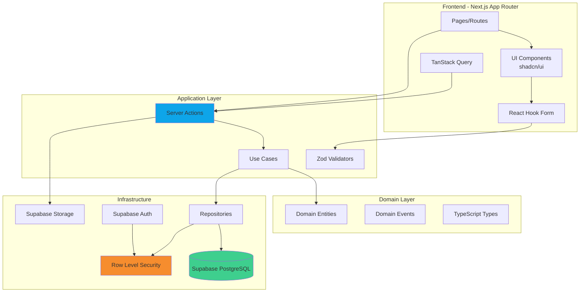
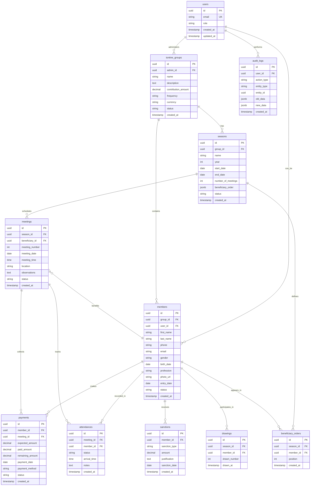

# Design Document - Plateforme SaaS de Gestion de Tontines

## Overview

La plateforme Tontine SaaS est une application web multi-tenant permettant à plusieurs administrateurs de gérer de manière indépendante leurs groupes de cotisation (tontines). Le système offre une isolation complète des données via Row Level Security (RLS) de Supabase, garantissant que chaque administrateur ne peut accéder qu'à ses propres groupes et membres.

### Vision Technique

L'architecture s'appuie sur Next.js 15 avec App Router pour le frontend, Supabase pour le backend (authentification, base de données PostgreSQL, storage), et suit les principes de Clean Architecture pour garantir maintenabilité, testabilité et évolutivité.

### Objectifs de Conception

1. **Sécurité maximale** : Isolation totale des données via RLS, validation multi-niveaux
2. **Performance optimale** : Pagination, lazy loading, caching intelligent, indexes optimisés
3. **Expérience utilisateur fluide** : Interface responsive, dark mode, design moderne inspiré de Notion/Linear
4. **Maintenabilité** : Code TypeScript strict, architecture en couches, composants réutilisables
5. **Accessibilité** : Conformité WCAG 2.1 niveau AA, support clavier complet, ARIA

### Stack Technique

**Frontend**
- Next.js 15.0+ (App Router, Server Components, Server Actions)
- React 19
- TypeScript 5.3+ (strict mode)
- TailwindCSS 3.4+ avec CSS Variables
- shadcn/ui pour les composants de base
- React Hook Form 7.x avec Zod pour la validation
- TanStack Query v5 pour le state management serveur
- date-fns pour la manipulation de dates
- Recharts pour les graphiques

**Backend & Infrastructure**
- Supabase Auth (authentification)
- PostgreSQL 15+ (via Supabase)
- Supabase Storage (upload de fichiers)
- Row Level Security (RLS) pour l'isolation des données
- Supabase Realtime (notifications en temps réel)

**Tooling**
- ESLint + Prettier
- Husky pour les git hooks
- Vitest pour les tests unitaires
- Playwright pour les tests E2E


## Architecture

### Architecture Générale

L'application suit une **Clean Architecture** organisée en couches concentriques avec une séparation stricte des responsabilités :

```
┌─────────────────────────────────────────────────────────┐
│                    Presentation Layer                    │
│  (UI Components, Pages, Forms, Hooks personnalisés)     │
└─────────────────────────┬───────────────────────────────┘
                          │
┌─────────────────────────▼───────────────────────────────┐
│                   Application Layer                      │
│     (Server Actions, Use Cases, Business Logic)         │
└─────────────────────────┬───────────────────────────────┘
                          │
┌─────────────────────────▼───────────────────────────────┐
│                    Domain Layer                          │
│    (Entities, Value Objects, Domain Events, Types)      │
└─────────────────────────┬───────────────────────────────┘
                          │
┌─────────────────────────▼───────────────────────────────┐
│                  Infrastructure Layer                    │
│  (Supabase Client, Repositories, External Services)     │
└─────────────────────────────────────────────────────────┘
```

### Diagramme de Composants



### Flux de Données

**Lecture de données (Query Flow)**
```
User Action → Page Component → TanStack Query Hook → Server Action
→ Use Case → Repository → Supabase Client (with RLS) → PostgreSQL
→ Data Transform → Return to UI → Cache in TanStack Query
```

**Écriture de données (Command Flow)**
```
User Submit Form → React Hook Form (validation Zod) → Server Action
→ Use Case (business logic) → Repository → Supabase Client (with RLS)
→ PostgreSQL + Audit Log → Optimistic Update → Revalidate Cache
→ Success/Error Response → UI Feedback
```

### Patterns Architecturaux Utilisés

#### 1. Repository Pattern
Abstraction de la couche d'accès aux données, facilitant les tests et le changement de backend.

```typescript
interface IGroupRepository {
  findById(id: string): Promise<TontineGroup | null>
  findByAdminId(adminId: string): Promise<TontineGroup[]>
  create(group: CreateTontineGroupDto): Promise<TontineGroup>
  update(id: string, data: UpdateTontineGroupDto): Promise<TontineGroup>
  delete(id: string): Promise<void>
}
```

#### 2. SOLID Principles

- **S**ingle Responsibility : Chaque composant a une seule raison de changer
- **O**pen/Closed : Extensions via composition, pas modification
- **L**iskov Substitution : Les implémentations respectent les contrats d'interface
- **I**nterface Segregation : Interfaces spécifiques plutôt que générales
- **D**ependency Inversion : Dépendances vers les abstractions, pas les implémentations

#### 3. Optimistic Updates
Pour une UX fluide, mise à jour immédiate de l'UI avec rollback en cas d'erreur.

#### 4. Server Components First
Utilisation maximale des Server Components Next.js pour réduire le JavaScript client.


## Components and Interfaces

### Structure Complète des Dossiers Next.js

```
tontine-platform/
├── .husky/                          # Git hooks
├── .vscode/                         # VS Code settings
├── public/                          # Assets statiques
│   ├── images/
│   └── icons/
├── src/
│   ├── app/                         # Next.js App Router
│   │   ├── (auth)/                  # Route group - pages publiques
│   │   │   ├── login/
│   │   │   │   └── page.tsx
│   │   │   ├── register/
│   │   │   │   └── page.tsx
│   │   │   ├── forgot-password/
│   │   │   │   └── page.tsx
│   │   │   └── layout.tsx           # Layout minimal sans sidebar
│   │   ├── (dashboard)/             # Route group - pages authentifiées
│   │   │   ├── dashboard/
│   │   │   │   └── page.tsx         # Dashboard principal
│   │   │   ├── groups/
│   │   │   │   ├── page.tsx         # Liste des groupes
│   │   │   │   ├── [id]/
│   │   │   │   │   ├── page.tsx     # Détail d'un groupe
│   │   │   │   │   ├── edit/
│   │   │   │   │   │   └── page.tsx
│   │   │   │   │   ├── members/
│   │   │   │   │   │   ├── page.tsx
│   │   │   │   │   │   └── [memberId]/
│   │   │   │   │   │       └── page.tsx
│   │   │   │   │   └── seasons/
│   │   │   │   │       ├── page.tsx
│   │   │   │   │       ├── new/
│   │   │   │   │       │   └── page.tsx
│   │   │   │   │       └── [seasonId]/
│   │   │   │   │           ├── page.tsx
│   │   │   │   │           ├── beneficiary-order/
│   │   │   │   │           │   └── page.tsx  # Attribution de l'ordre
│   │   │   │   │           └── meetings/
│   │   │   │   │               ├── page.tsx
│   │   │   │   │               └── [meetingId]/
│   │   │   │   │                   └── page.tsx
│   │   │   │   └── new/
│   │   │   │       └── page.tsx
│   │   │   ├── payments/
│   │   │   │   └── page.tsx
│   │   │   ├── members/
│   │   │   │   └── page.tsx
│   │   │   ├── reports/
│   │   │   │   └── page.tsx
│   │   │   ├── settings/
│   │   │   │   ├── page.tsx
│   │   │   │   ├── profile/
│   │   │   │   │   └── page.tsx
│   │   │   │   └── notifications/
│   │   │   │       └── page.tsx
│   │   │   └── layout.tsx           # Layout avec sidebar et header
│   │   ├── (member)/                # Route group - vue membre
│   │   │   ├── my-groups/
│   │   │   │   └── page.tsx
│   │   │   ├── my-payments/
│   │   │   │   └── page.tsx
│   │   │   ├── draw/
│   │   │   │   └── [seasonId]/
│   │   │   │       └── page.tsx     # Interface de tirage individuel
│   │   │   └── layout.tsx
│   │   ├── api/                     # API Routes (si nécessaire)
│   │   │   └── webhooks/
│   │   │       └── supabase/
│   │   │           └── route.ts
│   │   ├── layout.tsx               # Root layout
│   │   ├── globals.css              # Styles globaux
│   │   └── error.tsx                # Error boundary
│   │
│   ├── components/                  # Composants React
│   │   ├── ui/                      # Composants shadcn/ui de base
│   │   │   ├── button.tsx
│   │   │   ├── card.tsx
│   │   │   ├── dialog.tsx
│   │   │   ├── dropdown-menu.tsx
│   │   │   ├── form.tsx
│   │   │   ├── input.tsx
│   │   │   ├── label.tsx
│   │   │   ├── select.tsx
│   │   │   ├── table.tsx
│   │   │   ├── tabs.tsx
│   │   │   ├── toast.tsx
│   │   │   ├── avatar.tsx
│   │   │   ├── badge.tsx
│   │   │   ├── calendar.tsx
│   │   │   ├── checkbox.tsx
│   │   │   ├── popover.tsx
│   │   │   ├── separator.tsx
│   │   │   └── skeleton.tsx
│   │   ├── layout/                  # Composants de mise en page
│   │   │   ├── sidebar.tsx
│   │   │   ├── header.tsx
│   │   │   ├── footer.tsx
│   │   │   ├── breadcrumb.tsx
│   │   │   └── mobile-nav.tsx
│   │   ├── groups/                  # Composants métier - Groupes
│   │   │   ├── group-card.tsx
│   │   │   ├── group-list.tsx
│   │   │   ├── group-form.tsx
│   │   │   ├── group-details.tsx
│   │   │   └── group-stats.tsx
│   │   ├── members/                 # Composants métier - Membres
│   │   │   ├── member-card.tsx
│   │   │   ├── member-list.tsx
│   │   │   ├── member-form.tsx
│   │   │   ├── member-avatar.tsx
│   │   │   └── member-status-badge.tsx
│   │   ├── seasons/                 # Composants métier - Saisons
│   │   │   ├── season-card.tsx
│   │   │   ├── season-form.tsx
│   │   │   ├── beneficiary-order-display.tsx
│   │   │   ├── beneficiary-order-dragdrop.tsx
│   │   │   ├── drawing-interface.tsx
│   │   │   └── drawing-status.tsx
│   │   ├── meetings/                # Composants métier - Réunions
│   │   │   ├── meeting-card.tsx
│   │   │   ├── meeting-list.tsx
│   │   │   ├── meeting-form.tsx
│   │   │   ├── attendance-tracker.tsx
│   │   │   └── next-meeting-card.tsx
│   │   ├── payments/                # Composants métier - Paiements
│   │   │   ├── payment-form.tsx
│   │   │   ├── payment-list.tsx
│   │   │   ├── payment-status-badge.tsx
│   │   │   └── payment-summary.tsx
│   │   ├── dashboard/               # Composants dashboard
│   │   │   ├── stats-card.tsx
│   │   │   ├── recent-activity.tsx
│   │   │   ├── contribution-chart.tsx
│   │   │   ├── late-payments-widget.tsx
│   │   │   └── upcoming-meetings-widget.tsx
│   │   ├── common/                  # Composants communs
│   │   │   ├── data-table.tsx
│   │   │   ├── empty-state.tsx
│   │   │   ├── loading-spinner.tsx
│   │   │   ├── error-message.tsx
│   │   │   ├── confirmation-dialog.tsx
│   │   │   ├── search-input.tsx
│   │   │   ├── pagination.tsx
│   │   │   ├── date-picker.tsx
│   │   │   ├── currency-input.tsx
│   │   │   └── file-upload.tsx
│   │   └── providers/               # Context providers
│   │       ├── theme-provider.tsx
│   │       ├── query-provider.tsx
│   │       └── auth-provider.tsx
│   │
│   ├── lib/                         # Utilitaires et configuration
│   │   ├── supabase/
│   │   │   ├── client.ts            # Client Supabase côté client
│   │   │   ├── server.ts            # Client Supabase côté serveur
│   │   │   └── middleware.ts        # Middleware pour l'auth
│   │   ├── utils.ts                 # Utilitaires généraux (cn, etc.)
│   │   ├── constants.ts             # Constantes globales
│   │   ├── validators.ts            # Schémas Zod réutilisables
│   │   └── algorithms/              # Algorithmes métier
│   │       ├── drawing.ts           # Tirage individuel
│   │       ├── shuffle.ts           # Mélange automatique
│   │       ├── rotation.ts          # Rotation intelligente
│   │       └── crypto-random.ts     # Génération aléatoire sécurisée
│   │
│   ├── hooks/                       # React Hooks personnalisés
│   │   ├── use-auth.ts              # Hook d'authentification
│   │   ├── use-groups.ts            # Hook pour les groupes
│   │   ├── use-members.ts           # Hook pour les membres
│   │   ├── use-seasons.ts           # Hook pour les saisons
│   │   ├── use-meetings.ts          # Hook pour les réunions
│   │   ├── use-payments.ts          # Hook pour les paiements
│   │   ├── use-toast.ts             # Hook pour les notifications toast
│   │   ├── use-media-query.ts       # Hook responsive
│   │   └── use-debounce.ts          # Hook debounce
│   │
│   ├── actions/                     # Next.js Server Actions
│   │   ├── auth.actions.ts
│   │   ├── groups.actions.ts
│   │   ├── members.actions.ts
│   │   ├── seasons.actions.ts
│   │   ├── meetings.actions.ts
│   │   ├── payments.actions.ts
│   │   ├── sanctions.actions.ts
│   │   ├── drawing.actions.ts
│   │   └── exports.actions.ts
│   │
│   ├── repositories/                # Repository Pattern
│   │   ├── base.repository.ts       # Repository de base
│   │   ├── group.repository.ts
│   │   ├── member.repository.ts
│   │   ├── season.repository.ts
│   │   ├── meeting.repository.ts
│   │   ├── payment.repository.ts
│   │   ├── sanction.repository.ts
│   │   └── audit.repository.ts
│   │
│   ├── domain/                      # Domain Layer
│   │   ├── entities/                # Entités métier
│   │   │   ├── tontine-group.entity.ts
│   │   │   ├── member.entity.ts
│   │   │   ├── season.entity.ts
│   │   │   ├── meeting.entity.ts
│   │   │   ├── payment.entity.ts
│   │   │   └── sanction.entity.ts
│   │   ├── value-objects/           # Value Objects
│   │   │   ├── money.vo.ts
│   │   │   ├── email.vo.ts
│   │   │   └── phone.vo.ts
│   │   └── events/                  # Domain Events
│   │       ├── group-created.event.ts
│   │       ├── drawing-completed.event.ts
│   │       └── payment-recorded.event.ts
│   │
│   ├── types/                       # TypeScript Types & Interfaces
│   │   ├── database.types.ts        # Types générés par Supabase
│   │   ├── dto.types.ts             # Data Transfer Objects
│   │   ├── enums.ts                 # Énumérations
│   │   └── api.types.ts             # Types pour les API responses
│   │
│   └── middleware.ts                # Next.js Middleware
│
├── supabase/                        # Configuration Supabase
│   ├── migrations/                  # Migrations SQL
│   │   ├── 20240101000000_initial_schema.sql
│   │   ├── 20240101000001_rls_policies.sql
│   │   ├── 20240101000002_functions.sql
│   │   └── 20240101000003_triggers.sql
│   ├── seed.sql                     # Données de test
│   └── config.toml                  # Configuration Supabase
│
├── tests/                           # Tests
│   ├── unit/
│   ├── integration/
│   └── e2e/
│
├── .env.local.example               # Variables d'environnement exemple
├── .env.local                       # Variables d'environnement locales
├── .eslintrc.json                   # Configuration ESLint
├── .prettierrc                      # Configuration Prettier
├── next.config.js                   # Configuration Next.js
├── tailwind.config.ts               # Configuration Tailwind
├── tsconfig.json                    # Configuration TypeScript
├── components.json                  # Configuration shadcn/ui
└── package.json
```

### Interfaces Principales

#### Repository Interfaces

```typescript
// repositories/base.repository.ts
export interface IBaseRepository<T, CreateDTO, UpdateDTO> {
  findById(id: string): Promise<T | null>
  findAll(filters?: Record<string, any>): Promise<T[]>
  create(data: CreateDTO): Promise<T>
  update(id: string, data: UpdateDTO): Promise<T>
  delete(id: string): Promise<void>
}

// repositories/group.repository.ts
export interface IGroupRepository extends IBaseRepository<
  TontineGroup,
  CreateTontineGroupDto,
  UpdateTontineGroupDto
> {
  findByAdminId(adminId: string): Promise<TontineGroup[]>
  findWithMembers(id: string): Promise<TontineGroupWithMembers | null>
  countByAdminId(adminId: string): Promise<number>
}

// repositories/member.repository.ts
export interface IMemberRepository extends IBaseRepository<
  Member,
  CreateMemberDto,
  UpdateMemberDto
> {
  findByGroupId(groupId: string): Promise<Member[]>
  findActiveByGroupId(groupId: string): Promise<Member[]>
  findByEmail(email: string): Promise<Member | null>
  updateStatus(id: string, status: MemberStatus): Promise<Member>
}

// repositories/season.repository.ts
export interface ISeasonRepository extends IBaseRepository<
  Season,
  CreateSeasonDto,
  UpdateSeasonDto
> {
  findByGroupId(groupId: string): Promise<Season[]>
  findActiveByGroupId(groupId: string): Promise<Season | null>
  finalizeBeneficiaryOrder(id: string, order: string[]): Promise<Season>
  getPreviousSeason(groupId: string, currentSeasonId: string): Promise<Season | null>
}
```


## Data Models

### Modèle Conceptuel (Diagramme ER)



### Schéma SQL Complet de Supabase

#### Migration 1: Schema Initial

```sql
-- migrations/20240101000000_initial_schema.sql

-- Enable necessary extensions
CREATE EXTENSION IF NOT EXISTS "uuid-ossp";
CREATE EXTENSION IF NOT EXISTS "pgcrypto";

-- Enum types
CREATE TYPE user_role AS ENUM ('Super_Admin', 'Admin', 'Member');
CREATE TYPE group_status AS ENUM ('active', 'inactive', 'archived');
CREATE TYPE member_status AS ENUM ('active', 'suspended', 'excluded', 'left');
CREATE TYPE season_status AS ENUM ('draft', 'active', 'completed', 'cancelled');
CREATE TYPE meeting_status AS ENUM ('scheduled', 'completed', 'cancelled');
CREATE TYPE payment_status AS ENUM ('paid', 'partially_paid', 'unpaid', 'late');
CREATE TYPE payment_method AS ENUM ('cash', 'bank_transfer', 'mobile_money', 'check');
CREATE TYPE sanction_type AS ENUM ('fine', 'penalty', 'interest');
CREATE TYPE attendance_status AS ENUM ('present', 'absent', 'late', 'excused');
CREATE TYPE contribution_frequency AS ENUM ('weekly', 'biweekly', 'monthly', 'quarterly', 'custom');
CREATE TYPE gender_type AS ENUM ('male', 'female', 'other', 'prefer_not_to_say');
CREATE TYPE action_type AS ENUM (
    'create', 'update', 'delete', 
    'login', 'logout', 
    'drawing', 'finalize_order',
    'payment_record', 'sanction_apply'
);

-- Table: profiles (extends auth.users)
CREATE TABLE public.profiles (
    id UUID PRIMARY KEY REFERENCES auth.users(id) ON DELETE CASCADE,
    email TEXT UNIQUE NOT NULL,
    first_name TEXT,
    last_name TEXT,
    phone TEXT,
    avatar_url TEXT,
    role user_role NOT NULL DEFAULT 'Member',
    created_at TIMESTAMPTZ NOT NULL DEFAULT NOW(),
    updated_at TIMESTAMPTZ NOT NULL DEFAULT NOW()
);

-- Table: tontine_groups
CREATE TABLE public.tontine_groups (
    id UUID PRIMARY KEY DEFAULT uuid_generate_v4(),
    admin_id UUID NOT NULL REFERENCES public.profiles(id) ON DELETE CASCADE,
    name TEXT NOT NULL,
    description TEXT,
    contribution_amount DECIMAL(15, 2) NOT NULL CHECK (contribution_amount > 0),
    frequency contribution_frequency NOT NULL DEFAULT 'monthly',
    currency TEXT NOT NULL DEFAULT 'XAF',
    location TEXT,
    meeting_time TIME,
    status group_status NOT NULL DEFAULT 'active',
    created_at TIMESTAMPTZ NOT NULL DEFAULT NOW(),
    updated_at TIMESTAMPTZ NOT NULL DEFAULT NOW(),
    
    CONSTRAINT unique_group_name_per_admin UNIQUE (admin_id, name)
);

-- Table: members
CREATE TABLE public.members (
    id UUID PRIMARY KEY DEFAULT uuid_generate_v4(),
    group_id UUID NOT NULL REFERENCES public.tontine_groups(id) ON DELETE CASCADE,
    user_id UUID REFERENCES public.profiles(id) ON DELETE SET NULL,
    first_name TEXT NOT NULL,
    last_name TEXT NOT NULL,
    phone TEXT,
    email TEXT,
    gender gender_type,
    birth_date DATE,
    profession TEXT,
    photo_url TEXT,
    entry_date DATE NOT NULL DEFAULT CURRENT_DATE,
    status member_status NOT NULL DEFAULT 'active',
    created_at TIMESTAMPTZ NOT NULL DEFAULT NOW(),
    updated_at TIMESTAMPTZ NOT NULL DEFAULT NOW(),
    
    CONSTRAINT check_email_format CHECK (email ~* '^[A-Za-z0-9._%+-]+@[A-Za-z0-9.-]+\.[A-Za-z]{2,}$'),
    CONSTRAINT unique_member_email_per_group UNIQUE (group_id, email)
);

-- Table: seasons
CREATE TABLE public.seasons (
    id UUID PRIMARY KEY DEFAULT uuid_generate_v4(),
    group_id UUID NOT NULL REFERENCES public.tontine_groups(id) ON DELETE CASCADE,
    name TEXT NOT NULL,
    year INT NOT NULL,
    start_date DATE NOT NULL,
    end_date DATE NOT NULL,
    number_of_meetings INT NOT NULL CHECK (number_of_meetings > 0),
    beneficiary_order JSONB, -- Array of member IDs in order
    order_generation_mode TEXT CHECK (order_generation_mode IN ('individual_drawing', 'automatic_shuffle', 'manual', 'intelligent_rotation')),
    status season_status NOT NULL DEFAULT 'draft',
    created_at TIMESTAMPTZ NOT NULL DEFAULT NOW(),
    updated_at TIMESTAMPTZ NOT NULL DEFAULT NOW(),
    finalized_at TIMESTAMPTZ,
    
    CONSTRAINT check_dates CHECK (end_date > start_date),
    CONSTRAINT check_year CHECK (year >= 2020 AND year <= 2100),
    CONSTRAINT unique_season_name_per_group UNIQUE (group_id, name)
);

-- Table: meetings
CREATE TABLE public.meetings (
    id UUID PRIMARY KEY DEFAULT uuid_generate_v4(),
    season_id UUID NOT NULL REFERENCES public.seasons(id) ON DELETE CASCADE,
    beneficiary_id UUID REFERENCES public.members(id) ON DELETE SET NULL,
    meeting_number INT NOT NULL CHECK (meeting_number > 0),
    meeting_date DATE NOT NULL,
    meeting_time TIME,
    location TEXT,
    observations TEXT,
    status meeting_status NOT NULL DEFAULT 'scheduled',
    created_at TIMESTAMPTZ NOT NULL DEFAULT NOW(),
    updated_at TIMESTAMPTZ NOT NULL DEFAULT NOW(),
    
    CONSTRAINT unique_meeting_number_per_season UNIQUE (season_id, meeting_number)
);

-- Table: payments
CREATE TABLE public.payments (
    id UUID PRIMARY KEY DEFAULT uuid_generate_v4(),
    member_id UUID NOT NULL REFERENCES public.members(id) ON DELETE CASCADE,
    meeting_id UUID NOT NULL REFERENCES public.meetings(id) ON DELETE CASCADE,
    expected_amount DECIMAL(15, 2) NOT NULL CHECK (expected_amount >= 0),
    paid_amount DECIMAL(15, 2) NOT NULL DEFAULT 0 CHECK (paid_amount >= 0),
    remaining_amount DECIMAL(15, 2) GENERATED ALWAYS AS (expected_amount - paid_amount) STORED,
    payment_date DATE,
    payment_method payment_method,
    status payment_status NOT NULL DEFAULT 'unpaid',
    notes TEXT,
    created_at TIMESTAMPTZ NOT NULL DEFAULT NOW(),
    updated_at TIMESTAMPTZ NOT NULL DEFAULT NOW(),
    
    CONSTRAINT unique_payment_per_member_meeting UNIQUE (member_id, meeting_id)
);

-- Table: sanctions
CREATE TABLE public.sanctions (
    id UUID PRIMARY KEY DEFAULT uuid_generate_v4(),
    member_id UUID NOT NULL REFERENCES public.members(id) ON DELETE CASCADE,
    sanction_type sanction_type NOT NULL,
    amount DECIMAL(15, 2) NOT NULL CHECK (amount > 0),
    justification TEXT NOT NULL,
    sanction_date DATE NOT NULL DEFAULT CURRENT_DATE,
    created_at TIMESTAMPTZ NOT NULL DEFAULT NOW(),
    updated_at TIMESTAMPTZ NOT NULL DEFAULT NOW()
);

-- Table: attendances
CREATE TABLE public.attendances (
    id UUID PRIMARY KEY DEFAULT uuid_generate_v4(),
    meeting_id UUID NOT NULL REFERENCES public.meetings(id) ON DELETE CASCADE,
    member_id UUID NOT NULL REFERENCES public.members(id) ON DELETE CASCADE,
    status attendance_status NOT NULL DEFAULT 'absent',
    arrival_time TIME,
    notes TEXT,
    created_at TIMESTAMPTZ NOT NULL DEFAULT NOW(),
    updated_at TIMESTAMPTZ NOT NULL DEFAULT NOW(),
    
    CONSTRAINT unique_attendance_per_member_meeting UNIQUE (meeting_id, member_id)
);

-- Table: drawings
CREATE TABLE public.drawings (
    id UUID PRIMARY KEY DEFAULT uuid_generate_v4(),
    season_id UUID NOT NULL REFERENCES public.seasons(id) ON DELETE CASCADE,
    member_id UUID NOT NULL REFERENCES public.members(id) ON DELETE CASCADE,
    drawn_number INT NOT NULL CHECK (drawn_number > 0),
    drawn_at TIMESTAMPTZ NOT NULL DEFAULT NOW(),
    
    CONSTRAINT unique_drawing_per_member_season UNIQUE (season_id, member_id),
    CONSTRAINT unique_number_per_season UNIQUE (season_id, drawn_number)
);

-- Table: beneficiary_orders
CREATE TABLE public.beneficiary_orders (
    id UUID PRIMARY KEY DEFAULT uuid_generate_v4(),
    season_id UUID NOT NULL REFERENCES public.seasons(id) ON DELETE CASCADE,
    member_id UUID NOT NULL REFERENCES public.members(id) ON DELETE CASCADE,
    position INT NOT NULL CHECK (position > 0),
    created_at TIMESTAMPTZ NOT NULL DEFAULT NOW(),
    
    CONSTRAINT unique_position_per_season UNIQUE (season_id, position),
    CONSTRAINT unique_member_per_season UNIQUE (season_id, member_id)
);

-- Table: audit_logs (immutable)
CREATE TABLE public.audit_logs (
    id UUID PRIMARY KEY DEFAULT uuid_generate_v4(),
    user_id UUID REFERENCES public.profiles(id) ON DELETE SET NULL,
    action_type action_type NOT NULL,
    entity_type TEXT NOT NULL,
    entity_id UUID,
    old_data JSONB,
    new_data JSONB,
    ip_address INET,
    user_agent TEXT,
    created_at TIMESTAMPTZ NOT NULL DEFAULT NOW()
);

-- Indexes for performance
CREATE INDEX idx_tontine_groups_admin_id ON public.tontine_groups(admin_id);
CREATE INDEX idx_tontine_groups_status ON public.tontine_groups(status);

CREATE INDEX idx_members_group_id ON public.members(group_id);
CREATE INDEX idx_members_user_id ON public.members(user_id);
CREATE INDEX idx_members_status ON public.members(status);
CREATE INDEX idx_members_email ON public.members(email);

CREATE INDEX idx_seasons_group_id ON public.seasons(group_id);
CREATE INDEX idx_seasons_status ON public.seasons(status);
CREATE INDEX idx_seasons_dates ON public.seasons(start_date, end_date);

CREATE INDEX idx_meetings_season_id ON public.meetings(season_id);
CREATE INDEX idx_meetings_beneficiary_id ON public.meetings(beneficiary_id);
CREATE INDEX idx_meetings_date ON public.meetings(meeting_date);

CREATE INDEX idx_payments_member_id ON public.payments(member_id);
CREATE INDEX idx_payments_meeting_id ON public.payments(meeting_id);
CREATE INDEX idx_payments_status ON public.payments(status);
CREATE INDEX idx_payments_date ON public.payments(payment_date);

CREATE INDEX idx_sanctions_member_id ON public.sanctions(member_id);
CREATE INDEX idx_sanctions_date ON public.sanctions(sanction_date);

CREATE INDEX idx_attendances_meeting_id ON public.attendances(meeting_id);
CREATE INDEX idx_attendances_member_id ON public.attendances(member_id);

CREATE INDEX idx_drawings_season_id ON public.drawings(season_id);
CREATE INDEX idx_drawings_member_id ON public.drawings(member_id);

CREATE INDEX idx_beneficiary_orders_season_id ON public.beneficiary_orders(season_id);
CREATE INDEX idx_beneficiary_orders_member_id ON public.beneficiary_orders(member_id);

CREATE INDEX idx_audit_logs_user_id ON public.audit_logs(user_id);
CREATE INDEX idx_audit_logs_entity ON public.audit_logs(entity_type, entity_id);
CREATE INDEX idx_audit_logs_created_at ON public.audit_logs(created_at DESC);

-- Composite indexes for common queries
CREATE INDEX idx_members_group_status ON public.members(group_id, status);
CREATE INDEX idx_payments_member_status ON public.payments(member_id, status);
CREATE INDEX idx_seasons_group_status ON public.seasons(group_id, status);
```


#### Migration 2: Row Level Security Policies

```sql
-- migrations/20240101000001_rls_policies.sql

-- Enable RLS on all tables
ALTER TABLE public.profiles ENABLE ROW LEVEL SECURITY;
ALTER TABLE public.tontine_groups ENABLE ROW LEVEL SECURITY;
ALTER TABLE public.members ENABLE ROW LEVEL SECURITY;
ALTER TABLE public.seasons ENABLE ROW LEVEL SECURITY;
ALTER TABLE public.meetings ENABLE ROW LEVEL SECURITY;
ALTER TABLE public.payments ENABLE ROW LEVEL SECURITY;
ALTER TABLE public.sanctions ENABLE ROW LEVEL SECURITY;
ALTER TABLE public.attendances ENABLE ROW LEVEL SECURITY;
ALTER TABLE public.drawings ENABLE ROW LEVEL SECURITY;
ALTER TABLE public.beneficiary_orders ENABLE ROW LEVEL SECURITY;
ALTER TABLE public.audit_logs ENABLE ROW LEVEL SECURITY;

-- Profiles RLS Policies
CREATE POLICY "Users can view their own profile"
    ON public.profiles FOR SELECT
    USING (auth.uid() = id);

CREATE POLICY "Users can update their own profile"
    ON public.profiles FOR UPDATE
    USING (auth.uid() = id)
    WITH CHECK (auth.uid() = id);

CREATE POLICY "Super_Admin can view all profiles"
    ON public.profiles FOR SELECT
    USING (
        EXISTS (
            SELECT 1 FROM public.profiles
            WHERE id = auth.uid() AND role = 'Super_Admin'
        )
    );

-- Tontine Groups RLS Policies
CREATE POLICY "Admins can view their own groups"
    ON public.tontine_groups FOR SELECT
    USING (
        admin_id = auth.uid()
        OR EXISTS (
            SELECT 1 FROM public.profiles
            WHERE id = auth.uid() AND role = 'Super_Admin'
        )
    );

CREATE POLICY "Members can view groups they belong to"
    ON public.tontine_groups FOR SELECT
    USING (
        EXISTS (
            SELECT 1 FROM public.members
            WHERE members.group_id = tontine_groups.id
            AND members.user_id = auth.uid()
        )
    );

CREATE POLICY "Admins can create groups"
    ON public.tontine_groups FOR INSERT
    WITH CHECK (
        admin_id = auth.uid()
        AND EXISTS (
            SELECT 1 FROM public.profiles
            WHERE id = auth.uid() AND role IN ('Admin', 'Super_Admin')
        )
    );

CREATE POLICY "Admins can update their own groups"
    ON public.tontine_groups FOR UPDATE
    USING (admin_id = auth.uid())
    WITH CHECK (admin_id = auth.uid());

CREATE POLICY "Admins can delete their own groups"
    ON public.tontine_groups FOR DELETE
    USING (admin_id = auth.uid());

-- Members RLS Policies
CREATE POLICY "Admins can view members of their groups"
    ON public.members FOR SELECT
    USING (
        EXISTS (
            SELECT 1 FROM public.tontine_groups
            WHERE tontine_groups.id = members.group_id
            AND tontine_groups.admin_id = auth.uid()
        )
        OR user_id = auth.uid()
        OR EXISTS (
            SELECT 1 FROM public.profiles
            WHERE id = auth.uid() AND role = 'Super_Admin'
        )
    );

CREATE POLICY "Members can view themselves in groups"
    ON public.members FOR SELECT
    USING (user_id = auth.uid());

CREATE POLICY "Admins can insert members into their groups"
    ON public.members FOR INSERT
    WITH CHECK (
        EXISTS (
            SELECT 1 FROM public.tontine_groups
            WHERE tontine_groups.id = members.group_id
            AND tontine_groups.admin_id = auth.uid()
        )
    );

CREATE POLICY "Admins can update members of their groups"
    ON public.members FOR UPDATE
    USING (
        EXISTS (
            SELECT 1 FROM public.tontine_groups
            WHERE tontine_groups.id = members.group_id
            AND tontine_groups.admin_id = auth.uid()
        )
    )
    WITH CHECK (
        EXISTS (
            SELECT 1 FROM public.tontine_groups
            WHERE tontine_groups.id = members.group_id
            AND tontine_groups.admin_id = auth.uid()
        )
    );

CREATE POLICY "Admins can delete members from their groups"
    ON public.members FOR DELETE
    USING (
        EXISTS (
            SELECT 1 FROM public.tontine_groups
            WHERE tontine_groups.id = members.group_id
            AND tontine_groups.admin_id = auth.uid()
        )
    );

-- Seasons RLS Policies
CREATE POLICY "Admins can view seasons of their groups"
    ON public.seasons FOR SELECT
    USING (
        EXISTS (
            SELECT 1 FROM public.tontine_groups
            WHERE tontine_groups.id = seasons.group_id
            AND tontine_groups.admin_id = auth.uid()
        )
        OR EXISTS (
            SELECT 1 FROM public.tontine_groups
            JOIN public.members ON members.group_id = tontine_groups.id
            WHERE tontine_groups.id = seasons.group_id
            AND members.user_id = auth.uid()
        )
    );

CREATE POLICY "Admins can insert seasons for their groups"
    ON public.seasons FOR INSERT
    WITH CHECK (
        EXISTS (
            SELECT 1 FROM public.tontine_groups
            WHERE tontine_groups.id = seasons.group_id
            AND tontine_groups.admin_id = auth.uid()
        )
    );

CREATE POLICY "Admins can update seasons of their groups"
    ON public.seasons FOR UPDATE
    USING (
        EXISTS (
            SELECT 1 FROM public.tontine_groups
            WHERE tontine_groups.id = seasons.group_id
            AND tontine_groups.admin_id = auth.uid()
        )
    )
    WITH CHECK (
        EXISTS (
            SELECT 1 FROM public.tontine_groups
            WHERE tontine_groups.id = seasons.group_id
            AND tontine_groups.admin_id = auth.uid()
        )
    );

CREATE POLICY "Admins can delete seasons of their groups"
    ON public.seasons FOR DELETE
    USING (
        EXISTS (
            SELECT 1 FROM public.tontine_groups
            WHERE tontine_groups.id = seasons.group_id
            AND tontine_groups.admin_id = auth.uid()
        )
    );

-- Meetings RLS Policies
CREATE POLICY "Admins can manage meetings of their seasons"
    ON public.meetings FOR ALL
    USING (
        EXISTS (
            SELECT 1 FROM public.seasons
            JOIN public.tontine_groups ON tontine_groups.id = seasons.group_id
            WHERE seasons.id = meetings.season_id
            AND tontine_groups.admin_id = auth.uid()
        )
    )
    WITH CHECK (
        EXISTS (
            SELECT 1 FROM public.seasons
            JOIN public.tontine_groups ON tontine_groups.id = seasons.group_id
            WHERE seasons.id = meetings.season_id
            AND tontine_groups.admin_id = auth.uid()
        )
    );

CREATE POLICY "Members can view meetings of their groups"
    ON public.meetings FOR SELECT
    USING (
        EXISTS (
            SELECT 1 FROM public.seasons
            JOIN public.tontine_groups ON tontine_groups.id = seasons.group_id
            JOIN public.members ON members.group_id = tontine_groups.id
            WHERE seasons.id = meetings.season_id
            AND members.user_id = auth.uid()
        )
    );

-- Payments RLS Policies
CREATE POLICY "Admins can manage payments in their groups"
    ON public.payments FOR ALL
    USING (
        EXISTS (
            SELECT 1 FROM public.members
            JOIN public.tontine_groups ON tontine_groups.id = members.group_id
            WHERE members.id = payments.member_id
            AND tontine_groups.admin_id = auth.uid()
        )
    )
    WITH CHECK (
        EXISTS (
            SELECT 1 FROM public.members
            JOIN public.tontine_groups ON tontine_groups.id = members.group_id
            WHERE members.id = payments.member_id
            AND tontine_groups.admin_id = auth.uid()
        )
    );

CREATE POLICY "Members can view their own payments"
    ON public.payments FOR SELECT
    USING (
        EXISTS (
            SELECT 1 FROM public.members
            WHERE members.id = payments.member_id
            AND members.user_id = auth.uid()
        )
    );

-- Sanctions RLS Policies
CREATE POLICY "Admins can manage sanctions in their groups"
    ON public.sanctions FOR ALL
    USING (
        EXISTS (
            SELECT 1 FROM public.members
            JOIN public.tontine_groups ON tontine_groups.id = members.group_id
            WHERE members.id = sanctions.member_id
            AND tontine_groups.admin_id = auth.uid()
        )
    )
    WITH CHECK (
        EXISTS (
            SELECT 1 FROM public.members
            JOIN public.tontine_groups ON tontine_groups.id = members.group_id
            WHERE members.id = sanctions.member_id
            AND tontine_groups.admin_id = auth.uid()
        )
    );

CREATE POLICY "Members can view their own sanctions"
    ON public.sanctions FOR SELECT
    USING (
        EXISTS (
            SELECT 1 FROM public.members
            WHERE members.id = sanctions.member_id
            AND members.user_id = auth.uid()
        )
    );

-- Attendances RLS Policies
CREATE POLICY "Admins can manage attendances in their meetings"
    ON public.attendances FOR ALL
    USING (
        EXISTS (
            SELECT 1 FROM public.meetings
            JOIN public.seasons ON seasons.id = meetings.season_id
            JOIN public.tontine_groups ON tontine_groups.id = seasons.group_id
            WHERE meetings.id = attendances.meeting_id
            AND tontine_groups.admin_id = auth.uid()
        )
    )
    WITH CHECK (
        EXISTS (
            SELECT 1 FROM public.meetings
            JOIN public.seasons ON seasons.id = meetings.season_id
            JOIN public.tontine_groups ON tontine_groups.id = seasons.group_id
            WHERE meetings.id = attendances.meeting_id
            AND tontine_groups.admin_id = auth.uid()
        )
    );

CREATE POLICY "Members can view their own attendance"
    ON public.attendances FOR SELECT
    USING (
        EXISTS (
            SELECT 1 FROM public.members
            WHERE members.id = attendances.member_id
            AND members.user_id = auth.uid()
        )
    );

-- Drawings RLS Policies
CREATE POLICY "Members can view drawings in their seasons"
    ON public.drawings FOR SELECT
    USING (
        EXISTS (
            SELECT 1 FROM public.seasons
            JOIN public.tontine_groups ON tontine_groups.id = seasons.group_id
            JOIN public.members ON members.group_id = tontine_groups.id
            WHERE seasons.id = drawings.season_id
            AND members.user_id = auth.uid()
        )
    );

CREATE POLICY "Members can insert their own drawing"
    ON public.drawings FOR INSERT
    WITH CHECK (
        EXISTS (
            SELECT 1 FROM public.members
            WHERE members.id = drawings.member_id
            AND members.user_id = auth.uid()
        )
    );

CREATE POLICY "Admins can view all drawings in their seasons"
    ON public.drawings FOR SELECT
    USING (
        EXISTS (
            SELECT 1 FROM public.seasons
            JOIN public.tontine_groups ON tontine_groups.id = seasons.group_id
            WHERE seasons.id = drawings.season_id
            AND tontine_groups.admin_id = auth.uid()
        )
    );

-- Beneficiary Orders RLS Policies
CREATE POLICY "Admins can manage beneficiary orders"
    ON public.beneficiary_orders FOR ALL
    USING (
        EXISTS (
            SELECT 1 FROM public.seasons
            JOIN public.tontine_groups ON tontine_groups.id = seasons.group_id
            WHERE seasons.id = beneficiary_orders.season_id
            AND tontine_groups.admin_id = auth.uid()
        )
    )
    WITH CHECK (
        EXISTS (
            SELECT 1 FROM public.seasons
            JOIN public.tontine_groups ON tontine_groups.id = seasons.group_id
            WHERE seasons.id = beneficiary_orders.season_id
            AND tontine_groups.admin_id = auth.uid()
        )
    );

CREATE POLICY "Members can view beneficiary orders in their groups"
    ON public.beneficiary_orders FOR SELECT
    USING (
        EXISTS (
            SELECT 1 FROM public.seasons
            JOIN public.tontine_groups ON tontine_groups.id = seasons.group_id
            JOIN public.members ON members.group_id = tontine_groups.id
            WHERE seasons.id = beneficiary_orders.season_id
            AND members.user_id = auth.uid()
        )
    );

-- Audit Logs RLS Policies
CREATE POLICY "Super_Admin can view all audit logs"
    ON public.audit_logs FOR SELECT
    USING (
        EXISTS (
            SELECT 1 FROM public.profiles
            WHERE id = auth.uid() AND role = 'Super_Admin'
        )
    );

CREATE POLICY "Admins can view audit logs related to their groups"
    ON public.audit_logs FOR SELECT
    USING (
        user_id = auth.uid()
        OR EXISTS (
            SELECT 1 FROM public.profiles
            WHERE id = auth.uid() AND role = 'Super_Admin'
        )
    );

CREATE POLICY "System can insert audit logs"
    ON public.audit_logs FOR INSERT
    WITH CHECK (true); -- Inserts are handled by triggers

-- Prevent modifications to audit logs (immutable)
CREATE POLICY "No one can update audit logs"
    ON public.audit_logs FOR UPDATE
    USING (false);

CREATE POLICY "No one can delete audit logs"
    ON public.audit_logs FOR DELETE
    USING (false);
```


#### Migration 3: Functions and Stored Procedures

```sql
-- migrations/20240101000002_functions.sql

-- Function: Update updated_at timestamp automatically
CREATE OR REPLACE FUNCTION update_updated_at_column()
RETURNS TRIGGER AS $$
BEGIN
    NEW.updated_at = NOW();
    RETURN NEW;
END;
$$ LANGUAGE plpgsql;

-- Function: Generate cryptographically secure random number
CREATE OR REPLACE FUNCTION generate_secure_random_int(min_val INT, max_val INT)
RETURNS INT AS $$
DECLARE
    range_size INT := max_val - min_val + 1;
    random_bytes BYTEA;
    random_int BIGINT;
BEGIN
    random_bytes := gen_random_bytes(4);
    random_int := (get_byte(random_bytes, 0) << 24) |
                  (get_byte(random_bytes, 1) << 16) |
                  (get_byte(random_bytes, 2) << 8)  |
                   get_byte(random_bytes, 3);
    random_int := abs(random_int);
    RETURN min_val + (random_int % range_size);
END;
$$ LANGUAGE plpgsql SECURITY DEFINER;

-- Function: Get available drawing numbers for a season
CREATE OR REPLACE FUNCTION get_available_drawing_numbers(p_season_id UUID)
RETURNS TABLE(available_number INT) AS $$
BEGIN
    RETURN QUERY
    WITH all_numbers AS (
        SELECT generate_series(1, (
            SELECT number_of_meetings 
            FROM public.seasons 
            WHERE id = p_season_id
        )) AS num
    )
    SELECT an.num
    FROM all_numbers an
    WHERE an.num NOT IN (
        SELECT drawn_number 
        FROM public.drawings 
        WHERE season_id = p_season_id
    )
    ORDER BY an.num;
END;
$$ LANGUAGE plpgsql SECURITY DEFINER;

-- Function: Perform individual drawing (atomic operation)
CREATE OR REPLACE FUNCTION perform_individual_drawing(
    p_season_id UUID,
    p_member_id UUID
)
RETURNS TABLE(drawn_number INT, success BOOLEAN, message TEXT) AS $$
DECLARE
    v_available_numbers INT[];
    v_random_index INT;
    v_drawn_number INT;
    v_already_drawn BOOLEAN;
    v_season_finalized BOOLEAN;
BEGIN
    -- Check if member already drew
    SELECT EXISTS(
        SELECT 1 FROM public.drawings 
        WHERE season_id = p_season_id AND member_id = p_member_id
    ) INTO v_already_drawn;
    
    IF v_already_drawn THEN
        RETURN QUERY SELECT NULL::INT, FALSE, 'Member has already drawn a number'::TEXT;
        RETURN;
    END IF;
    
    -- Check if season is finalized
    SELECT (status != 'draft') INTO v_season_finalized
    FROM public.seasons WHERE id = p_season_id;
    
    IF v_season_finalized THEN
        RETURN QUERY SELECT NULL::INT, FALSE, 'Season order is already finalized'::TEXT;
        RETURN;
    END IF;
    
    -- Get available numbers
    SELECT ARRAY(
        SELECT available_number 
        FROM get_available_drawing_numbers(p_season_id)
    ) INTO v_available_numbers;
    
    IF array_length(v_available_numbers, 1) IS NULL THEN
        RETURN QUERY SELECT NULL::INT, FALSE, 'No available numbers remaining'::TEXT;
        RETURN;
    END IF;
    
    -- Generate secure random index
    v_random_index := generate_secure_random_int(1, array_length(v_available_numbers, 1));
    v_drawn_number := v_available_numbers[v_random_index];
    
    -- Insert drawing
    INSERT INTO public.drawings (season_id, member_id, drawn_number)
    VALUES (p_season_id, p_member_id, v_drawn_number);
    
    RETURN QUERY SELECT v_drawn_number, TRUE, 'Drawing successful'::TEXT;
END;
$$ LANGUAGE plpgsql SECURITY DEFINER;

-- Function: Finalize beneficiary order from drawings
CREATE OR REPLACE FUNCTION finalize_beneficiary_order_from_drawings(p_season_id UUID)
RETURNS TABLE(success BOOLEAN, message TEXT) AS $$
DECLARE
    v_expected_count INT;
    v_actual_count INT;
    v_member_record RECORD;
BEGIN
    -- Get expected number of members
    SELECT number_of_meetings INTO v_expected_count
    FROM public.seasons WHERE id = p_season_id;
    
    -- Get actual drawings count
    SELECT COUNT(*) INTO v_actual_count
    FROM public.drawings WHERE season_id = p_season_id;
    
    -- Validate all members have drawn
    IF v_actual_count < v_expected_count THEN
        RETURN QUERY SELECT FALSE, format('Only %s of %s members have drawn', v_actual_count, v_expected_count)::TEXT;
        RETURN;
    END IF;
    
    -- Clear any existing beneficiary orders
    DELETE FROM public.beneficiary_orders WHERE season_id = p_season_id;
    
    -- Insert beneficiary orders based on drawings
    FOR v_member_record IN 
        SELECT member_id, drawn_number
        FROM public.drawings
        WHERE season_id = p_season_id
        ORDER BY drawn_number
    LOOP
        INSERT INTO public.beneficiary_orders (season_id, member_id, position)
        VALUES (p_season_id, v_member_record.member_id, v_member_record.drawn_number);
    END LOOP;
    
    -- Update season status
    UPDATE public.seasons
    SET status = 'active', finalized_at = NOW()
    WHERE id = p_season_id;
    
    RETURN QUERY SELECT TRUE, 'Beneficiary order finalized successfully'::TEXT;
END;
$$ LANGUAGE plpgsql SECURITY DEFINER;

-- Function: Generate automatic shuffle (Fisher-Yates algorithm)
CREATE OR REPLACE FUNCTION generate_automatic_shuffle(p_season_id UUID)
RETURNS TABLE(success BOOLEAN, message TEXT) AS $$
DECLARE
    v_group_id UUID;
    v_members UUID[];
    v_member_id UUID;
    v_position INT := 1;
    v_random_index INT;
    v_temp UUID;
    i INT;
BEGIN
    -- Get group_id
    SELECT group_id INTO v_group_id FROM public.seasons WHERE id = p_season_id;
    
    -- Get all active members
    SELECT ARRAY(
        SELECT id FROM public.members 
        WHERE group_id = v_group_id AND status = 'active'
        ORDER BY id
    ) INTO v_members;
    
    IF array_length(v_members, 1) IS NULL THEN
        RETURN QUERY SELECT FALSE, 'No active members found'::TEXT;
        RETURN;
    END IF;
    
    -- Fisher-Yates shuffle with cryptographically secure random
    FOR i IN REVERSE array_length(v_members, 1)..2 LOOP
        v_random_index := generate_secure_random_int(1, i);
        v_temp := v_members[i];
        v_members[i] := v_members[v_random_index];
        v_members[v_random_index] := v_temp;
    END LOOP;
    
    -- Clear existing beneficiary orders
    DELETE FROM public.beneficiary_orders WHERE season_id = p_season_id;
    
    -- Insert shuffled order
    FOREACH v_member_id IN ARRAY v_members LOOP
        INSERT INTO public.beneficiary_orders (season_id, member_id, position)
        VALUES (p_season_id, v_member_id, v_position);
        v_position := v_position + 1;
    END LOOP;
    
    -- Update season
    UPDATE public.seasons
    SET 
        status = 'active',
        order_generation_mode = 'automatic_shuffle',
        finalized_at = NOW()
    WHERE id = p_season_id;
    
    RETURN QUERY SELECT TRUE, 'Automatic shuffle completed successfully'::TEXT;
END;
$$ LANGUAGE plpgsql SECURITY DEFINER;

-- Function: Generate intelligent rotation based on previous season
CREATE OR REPLACE FUNCTION generate_intelligent_rotation(p_season_id UUID)
RETURNS TABLE(success BOOLEAN, message TEXT) AS $$
DECLARE
    v_group_id UUID;
    v_previous_season_id UUID;
    v_previous_order UUID[];
    v_current_members UUID[];
    v_rotated_order UUID[];
    v_new_members UUID[];
    v_member_id UUID;
    v_position INT := 1;
BEGIN
    -- Get group_id
    SELECT group_id INTO v_group_id FROM public.seasons WHERE id = p_season_id;
    
    -- Get previous season
    SELECT id INTO v_previous_season_id
    FROM public.seasons
    WHERE group_id = v_group_id 
      AND id != p_season_id
      AND status = 'completed'
    ORDER BY end_date DESC
    LIMIT 1;
    
    IF v_previous_season_id IS NULL THEN
        RETURN QUERY SELECT FALSE, 'No previous completed season found'::TEXT;
        RETURN;
    END IF;
    
    -- Get previous beneficiary order
    SELECT ARRAY(
        SELECT member_id 
        FROM public.beneficiary_orders
        WHERE season_id = v_previous_season_id
        ORDER BY position
    ) INTO v_previous_order;
    
    -- Get current active members
    SELECT ARRAY(
        SELECT id FROM public.members
        WHERE group_id = v_group_id AND status = 'active'
    ) INTO v_current_members;
    
    -- Rotate: last becomes first
    v_rotated_order := array_append(v_previous_order[array_length(v_previous_order, 1):array_length(v_previous_order, 1)], NULL);
    v_rotated_order := array_cat(v_rotated_order, v_previous_order[1:array_length(v_previous_order, 1)-1]);
    
    -- Remove null
    v_rotated_order := array_remove(v_rotated_order, NULL);
    
    -- Filter out members who left or are suspended
    v_rotated_order := ARRAY(
        SELECT unnest(v_rotated_order)
        INTERSECT
        SELECT unnest(v_current_members)
    );
    
    -- Find new members
    v_new_members := ARRAY(
        SELECT unnest(v_current_members)
        EXCEPT
        SELECT unnest(v_rotated_order)
    );
    
    -- Append new members at the end
    v_rotated_order := array_cat(v_rotated_order, v_new_members);
    
    -- Clear existing beneficiary orders
    DELETE FROM public.beneficiary_orders WHERE season_id = p_season_id;
    
    -- Insert rotated order
    FOREACH v_member_id IN ARRAY v_rotated_order LOOP
        INSERT INTO public.beneficiary_orders (season_id, member_id, position)
        VALUES (p_season_id, v_member_id, v_position);
        v_position := v_position + 1;
    END LOOP;
    
    -- Update season
    UPDATE public.seasons
    SET 
        status = 'active',
        order_generation_mode = 'intelligent_rotation',
        finalized_at = NOW()
    WHERE id = p_season_id;
    
    RETURN QUERY SELECT TRUE, 'Intelligent rotation completed successfully'::TEXT;
END;
$$ LANGUAGE plpgsql SECURITY DEFINER;

-- Function: Calculate member statistics
CREATE OR REPLACE FUNCTION get_member_statistics(p_member_id UUID)
RETURNS TABLE(
    total_payments BIGINT,
    total_paid DECIMAL,
    total_unpaid DECIMAL,
    attendance_rate DECIMAL,
    total_sanctions BIGINT,
    total_sanctions_amount DECIMAL
) AS $$
BEGIN
    RETURN QUERY
    SELECT
        COUNT(p.id)::BIGINT as total_payments,
        COALESCE(SUM(p.paid_amount), 0) as total_paid,
        COALESCE(SUM(p.remaining_amount), 0) as total_unpaid,
        CASE 
            WHEN COUNT(a.id) > 0 THEN
                (COUNT(CASE WHEN a.status = 'present' THEN 1 END)::DECIMAL / COUNT(a.id)::DECIMAL) * 100
            ELSE 0
        END as attendance_rate,
        COUNT(s.id)::BIGINT as total_sanctions,
        COALESCE(SUM(s.amount), 0) as total_sanctions_amount
    FROM public.members m
    LEFT JOIN public.payments p ON p.member_id = m.id
    LEFT JOIN public.attendances a ON a.member_id = m.id
    LEFT JOIN public.sanctions s ON s.member_id = m.id
    WHERE m.id = p_member_id
    GROUP BY m.id;
END;
$$ LANGUAGE plpgsql SECURITY DEFINER;

-- Function: Get dashboard statistics for admin
CREATE OR REPLACE FUNCTION get_admin_dashboard_stats(p_admin_id UUID)
RETURNS TABLE(
    total_groups BIGINT,
    total_members BIGINT,
    total_collected DECIMAL,
    active_seasons BIGINT,
    late_payments BIGINT
) AS $$
BEGIN
    RETURN QUERY
    SELECT
        COUNT(DISTINCT g.id)::BIGINT as total_groups,
        COUNT(DISTINCT m.id)::BIGINT as total_members,
        COALESCE(SUM(p.paid_amount), 0) as total_collected,
        COUNT(DISTINCT CASE WHEN s.status = 'active' THEN s.id END)::BIGINT as active_seasons,
        COUNT(CASE WHEN p.status = 'late' THEN p.id END)::BIGINT as late_payments
    FROM public.tontine_groups g
    LEFT JOIN public.members m ON m.group_id = g.id
    LEFT JOIN public.seasons s ON s.group_id = g.id
    LEFT JOIN public.payments p ON p.member_id = m.id
    WHERE g.admin_id = p_admin_id;
END;
$$ LANGUAGE plpgsql SECURITY DEFINER;
```


#### Migration 4: Triggers and Automation

```sql
-- migrations/20240101000003_triggers.sql

-- Trigger: Update updated_at on all relevant tables
CREATE TRIGGER update_profiles_updated_at
    BEFORE UPDATE ON public.profiles
    FOR EACH ROW
    EXECUTE FUNCTION update_updated_at_column();

CREATE TRIGGER update_tontine_groups_updated_at
    BEFORE UPDATE ON public.tontine_groups
    FOR EACH ROW
    EXECUTE FUNCTION update_updated_at_column();

CREATE TRIGGER update_members_updated_at
    BEFORE UPDATE ON public.members
    FOR EACH ROW
    EXECUTE FUNCTION update_updated_at_column();

CREATE TRIGGER update_seasons_updated_at
    BEFORE UPDATE ON public.seasons
    FOR EACH ROW
    EXECUTE FUNCTION update_updated_at_column();

CREATE TRIGGER update_meetings_updated_at
    BEFORE UPDATE ON public.meetings
    FOR EACH ROW
    EXECUTE FUNCTION update_updated_at_column();

CREATE TRIGGER update_payments_updated_at
    BEFORE UPDATE ON public.payments
    FOR EACH ROW
    EXECUTE FUNCTION update_updated_at_column();

CREATE TRIGGER update_sanctions_updated_at
    BEFORE UPDATE ON public.sanctions
    FOR EACH ROW
    EXECUTE FUNCTION update_updated_at_column();

CREATE TRIGGER update_attendances_updated_at
    BEFORE UPDATE ON public.attendances
    FOR EACH ROW
    EXECUTE FUNCTION update_updated_at_column();

-- Trigger: Auto-create profile on user signup
CREATE OR REPLACE FUNCTION handle_new_user()
RETURNS TRIGGER AS $$
BEGIN
    INSERT INTO public.profiles (id, email, role)
    VALUES (NEW.id, NEW.email, 'Member');
    RETURN NEW;
END;
$$ LANGUAGE plpgsql SECURITY DEFINER;

CREATE TRIGGER on_auth_user_created
    AFTER INSERT ON auth.users
    FOR EACH ROW
    EXECUTE FUNCTION handle_new_user();

-- Trigger: Audit log on tontine_groups changes
CREATE OR REPLACE FUNCTION audit_tontine_groups()
RETURNS TRIGGER AS $$
BEGIN
    IF TG_OP = 'INSERT' THEN
        INSERT INTO public.audit_logs (user_id, action_type, entity_type, entity_id, new_data)
        VALUES (auth.uid(), 'create', 'tontine_group', NEW.id, to_jsonb(NEW));
        RETURN NEW;
    ELSIF TG_OP = 'UPDATE' THEN
        INSERT INTO public.audit_logs (user_id, action_type, entity_type, entity_id, old_data, new_data)
        VALUES (auth.uid(), 'update', 'tontine_group', NEW.id, to_jsonb(OLD), to_jsonb(NEW));
        RETURN NEW;
    ELSIF TG_OP = 'DELETE' THEN
        INSERT INTO public.audit_logs (user_id, action_type, entity_type, entity_id, old_data)
        VALUES (auth.uid(), 'delete', 'tontine_group', OLD.id, to_jsonb(OLD));
        RETURN OLD;
    END IF;
END;
$$ LANGUAGE plpgsql SECURITY DEFINER;

CREATE TRIGGER audit_tontine_groups_trigger
    AFTER INSERT OR UPDATE OR DELETE ON public.tontine_groups
    FOR EACH ROW
    EXECUTE FUNCTION audit_tontine_groups();

-- Trigger: Audit log on members changes
CREATE OR REPLACE FUNCTION audit_members()
RETURNS TRIGGER AS $$
BEGIN
    IF TG_OP = 'INSERT' THEN
        INSERT INTO public.audit_logs (user_id, action_type, entity_type, entity_id, new_data)
        VALUES (auth.uid(), 'create', 'member', NEW.id, to_jsonb(NEW));
    ELSIF TG_OP = 'UPDATE' THEN
        INSERT INTO public.audit_logs (user_id, action_type, entity_type, entity_id, old_data, new_data)
        VALUES (auth.uid(), 'update', 'member', NEW.id, to_jsonb(OLD), to_jsonb(NEW));
    ELSIF TG_OP = 'DELETE' THEN
        INSERT INTO public.audit_logs (user_id, action_type, entity_type, entity_id, old_data)
        VALUES (auth.uid(), 'delete', 'member', OLD.id, to_jsonb(OLD));
    END IF;
    RETURN COALESCE(NEW, OLD);
END;
$$ LANGUAGE plpgsql SECURITY DEFINER;

CREATE TRIGGER audit_members_trigger
    AFTER INSERT OR UPDATE OR DELETE ON public.members
    FOR EACH ROW
    EXECUTE FUNCTION audit_members();

-- Trigger: Audit log on seasons changes
CREATE OR REPLACE FUNCTION audit_seasons()
RETURNS TRIGGER AS $$
BEGIN
    IF TG_OP = 'INSERT' THEN
        INSERT INTO public.audit_logs (user_id, action_type, entity_type, entity_id, new_data)
        VALUES (auth.uid(), 'create', 'season', NEW.id, to_jsonb(NEW));
    ELSIF TG_OP = 'UPDATE' AND OLD.status = 'draft' AND NEW.status = 'active' THEN
        INSERT INTO public.audit_logs (user_id, action_type, entity_type, entity_id, old_data, new_data)
        VALUES (auth.uid(), 'finalize_order', 'season', NEW.id, to_jsonb(OLD), to_jsonb(NEW));
    ELSIF TG_OP = 'UPDATE' THEN
        INSERT INTO public.audit_logs (user_id, action_type, entity_type, entity_id, old_data, new_data)
        VALUES (auth.uid(), 'update', 'season', NEW.id, to_jsonb(OLD), to_jsonb(NEW));
    ELSIF TG_OP = 'DELETE' THEN
        INSERT INTO public.audit_logs (user_id, action_type, entity_type, entity_id, old_data)
        VALUES (auth.uid(), 'delete', 'season', OLD.id, to_jsonb(OLD));
    END IF;
    RETURN COALESCE(NEW, OLD);
END;
$$ LANGUAGE plpgsql SECURITY DEFINER;

CREATE TRIGGER audit_seasons_trigger
    AFTER INSERT OR UPDATE OR DELETE ON public.seasons
    FOR EACH ROW
    EXECUTE FUNCTION audit_seasons();

-- Trigger: Audit log on payments
CREATE OR REPLACE FUNCTION audit_payments()
RETURNS TRIGGER AS $$
BEGIN
    IF TG_OP = 'INSERT' THEN
        INSERT INTO public.audit_logs (user_id, action_type, entity_type, entity_id, new_data)
        VALUES (auth.uid(), 'payment_record', 'payment', NEW.id, to_jsonb(NEW));
    ELSIF TG_OP = 'UPDATE' THEN
        INSERT INTO public.audit_logs (user_id, action_type, entity_type, entity_id, old_data, new_data)
        VALUES (auth.uid(), 'payment_record', 'payment', NEW.id, to_jsonb(OLD), to_jsonb(NEW));
    END IF;
    RETURN NEW;
END;
$$ LANGUAGE plpgsql SECURITY DEFINER;

CREATE TRIGGER audit_payments_trigger
    AFTER INSERT OR UPDATE ON public.payments
    FOR EACH ROW
    EXECUTE FUNCTION audit_payments();

-- Trigger: Audit log on sanctions
CREATE OR REPLACE FUNCTION audit_sanctions()
RETURNS TRIGGER AS $$
BEGIN
    IF TG_OP = 'INSERT' THEN
        INSERT INTO public.audit_logs (user_id, action_type, entity_type, entity_id, new_data)
        VALUES (auth.uid(), 'sanction_apply', 'sanction', NEW.id, to_jsonb(NEW));
    END IF;
    RETURN NEW;
END;
$$ LANGUAGE plpgsql SECURITY DEFINER;

CREATE TRIGGER audit_sanctions_trigger
    AFTER INSERT ON public.sanctions
    FOR EACH ROW
    EXECUTE FUNCTION audit_sanctions();

-- Trigger: Audit log on drawings
CREATE OR REPLACE FUNCTION audit_drawings()
RETURNS TRIGGER AS $$
BEGIN
    INSERT INTO public.audit_logs (user_id, action_type, entity_type, entity_id, new_data)
    VALUES (auth.uid(), 'drawing', 'drawing', NEW.id, to_jsonb(NEW));
    RETURN NEW;
END;
$$ LANGUAGE plpgsql SECURITY DEFINER;

CREATE TRIGGER audit_drawings_trigger
    AFTER INSERT ON public.drawings
    FOR EACH ROW
    EXECUTE FUNCTION audit_drawings();

-- Trigger: Automatically update payment status based on amounts
CREATE OR REPLACE FUNCTION update_payment_status()
RETURNS TRIGGER AS $$
BEGIN
    IF NEW.remaining_amount <= 0 THEN
        NEW.status := 'paid';
    ELSIF NEW.paid_amount > 0 AND NEW.remaining_amount > 0 THEN
        NEW.status := 'partially_paid';
    ELSIF NEW.paid_amount = 0 THEN
        NEW.status := 'unpaid';
    END IF;
    RETURN NEW;
END;
$$ LANGUAGE plpgsql;

CREATE TRIGGER update_payment_status_trigger
    BEFORE INSERT OR UPDATE OF paid_amount, expected_amount ON public.payments
    FOR EACH ROW
    EXECUTE FUNCTION update_payment_status();

-- Trigger: Validate beneficiary order completeness before finalizing
CREATE OR REPLACE FUNCTION validate_beneficiary_order_completeness()
RETURNS TRIGGER AS $$
DECLARE
    v_expected_count INT;
    v_actual_count INT;
BEGIN
    IF NEW.status = 'active' AND OLD.status = 'draft' THEN
        -- Get expected number
        v_expected_count := NEW.number_of_meetings;
        
        -- Get actual count in beneficiary_orders
        SELECT COUNT(*) INTO v_actual_count
        FROM public.beneficiary_orders
        WHERE season_id = NEW.id;
        
        IF v_actual_count != v_expected_count THEN
            RAISE EXCEPTION 'Cannot finalize season: expected % beneficiaries but found %', 
                v_expected_count, v_actual_count;
        END IF;
    END IF;
    RETURN NEW;
END;
$$ LANGUAGE plpgsql;

CREATE TRIGGER validate_beneficiary_order_trigger
    BEFORE UPDATE ON public.seasons
    FOR EACH ROW
    WHEN (NEW.status = 'active' AND OLD.status = 'draft')
    EXECUTE FUNCTION validate_beneficiary_order_completeness();
```

### TypeScript Types Générés

Les types TypeScript seront générés automatiquement depuis le schéma Supabase avec la commande :

```bash
npx supabase gen types typescript --project-id <project-id> > src/types/database.types.ts
```

Exemple de types générés :

```typescript
// types/database.types.ts (excerpt)
export type Database = {
  public: {
    Tables: {
      tontine_groups: {
        Row: {
          id: string
          admin_id: string
          name: string
          description: string | null
          contribution_amount: number
          frequency: 'weekly' | 'biweekly' | 'monthly' | 'quarterly' | 'custom'
          currency: string
          location: string | null
          meeting_time: string | null
          status: 'active' | 'inactive' | 'archived'
          created_at: string
          updated_at: string
        }
        Insert: {
          id?: string
          admin_id: string
          name: string
          description?: string | null
          contribution_amount: number
          frequency?: 'weekly' | 'biweekly' | 'monthly' | 'quarterly' | 'custom'
          currency?: string
          location?: string | null
          meeting_time?: string | null
          status?: 'active' | 'inactive' | 'archived'
          created_at?: string
          updated_at?: string
        }
        Update: {
          id?: string
          admin_id?: string
          name?: string
          description?: string | null
          contribution_amount?: number
          frequency?: 'weekly' | 'biweekly' | 'monthly' | 'quarterly' | 'custom'
          currency?: string
          location?: string | null
          meeting_time?: string | null
          status?: 'active' | 'inactive' | 'archived'
          created_at?: string
          updated_at?: string
        }
      }
      // ... autres tables
    }
    Views: {}
    Functions: {
      perform_individual_drawing: {
        Args: {
          p_season_id: string
          p_member_id: string
        }
        Returns: {
          drawn_number: number
          success: boolean
          message: string
        }[]
      }
      // ... autres fonctions
    }
    Enums: {
      user_role: 'Super_Admin' | 'Admin' | 'Member'
      group_status: 'active' | 'inactive' | 'archived'
      // ... autres enums
    }
  }
}
```


## Algorithmes Clés

### Algorithme 1: Tirage Individuel (Individual Drawing)

**Objectif** : Permettre à chaque membre de tirer un numéro unique de manière sécurisée et équitable.

**Contraintes** :
- Chaque membre ne peut tirer qu'une seule fois
- Les numéros doivent être uniques (pas de doublons)
- Utilisation de randomness cryptographique (pas de `Math.random()`)
- Opération atomique (transaction database)

**Implémentation TypeScript** :

```typescript
// lib/algorithms/drawing.ts

import { createClient } from '@/lib/supabase/server'

export interface DrawingResult {
  drawnNumber: number | null
  success: boolean
  message: string
}

/**
 * Effectue un tirage individuel pour un membre dans une saison
 * Utilise une fonction PostgreSQL pour garantir l'atomicité
 * 
 * @param seasonId - ID de la saison
 * @param memberId - ID du membre effectuant le tirage
 * @returns Résultat du tirage avec le numéro tiré
 */
export async function performIndividualDrawing(
  seasonId: string,
  memberId: string
): Promise<DrawingResult> {
  const supabase = createClient()
  
  try {
    // Appel de la fonction PostgreSQL qui gère l'atomicité
    const { data, error } = await supabase.rpc('perform_individual_drawing', {
      p_season_id: seasonId,
      p_member_id: memberId,
    })
    
    if (error) {
      console.error('Drawing error:', error)
      return {
        drawnNumber: null,
        success: false,
        message: error.message,
      }
    }
    
    if (!data || data.length === 0) {
      return {
        drawnNumber: null,
        success: false,
        message: 'No response from drawing function',
      }
    }
    
    const result = data[0]
    return {
      drawnNumber: result.drawn_number,
      success: result.success,
      message: result.message,
    }
  } catch (error) {
    console.error('Unexpected drawing error:', error)
    return {
      drawnNumber: null,
      success: false,
      message: 'An unexpected error occurred during drawing',
    }
  }
}

/**
 * Récupère les numéros disponibles pour le tirage
 * 
 * @param seasonId - ID de la saison
 * @returns Array des numéros disponibles
 */
export async function getAvailableDrawingNumbers(
  seasonId: string
): Promise<number[]> {
  const supabase = createClient()
  
  const { data, error } = await supabase.rpc('get_available_drawing_numbers', {
    p_season_id: seasonId,
  })
  
  if (error) {
    console.error('Error fetching available numbers:', error)
    return []
  }
  
  return data?.map((row: any) => row.available_number) ?? []
}

/**
 * Vérifie si un membre a déjà effectué son tirage
 * 
 * @param seasonId - ID de la saison
 * @param memberId - ID du membre
 * @returns true si le membre a déjà tiré
 */
export async function hasAlreadyDrawn(
  seasonId: string,
  memberId: string
): Promise<boolean> {
  const supabase = createClient()
  
  const { data, error } = await supabase
    .from('drawings')
    .select('id')
    .eq('season_id', seasonId)
    .eq('member_id', memberId)
    .single()
  
  return !!data && !error
}

/**
 * Récupère le statut du tirage pour une saison
 * 
 * @param seasonId - ID de la saison
 * @returns Statistiques du tirage
 */
export async function getDrawingStatus(seasonId: string) {
  const supabase = createClient()
  
  // Récupérer la saison et le nombre total de membres
  const { data: season, error: seasonError } = await supabase
    .from('seasons')
    .select('number_of_meetings, group_id')
    .eq('id', seasonId)
    .single()
  
  if (seasonError || !season) {
    throw new Error('Season not found')
  }
  
  // Récupérer le nombre de tirages effectués
  const { count: drawingsCount, error: drawingsError } = await supabase
    .from('drawings')
    .select('*', { count: 'exact', head: true })
    .eq('season_id', seasonId)
  
  if (drawingsError) {
    throw new Error('Error fetching drawings count')
  }
  
  const totalMembers = season.number_of_meetings
  const completedDrawings = drawingsCount ?? 0
  const remainingDrawings = totalMembers - completedDrawings
  const isComplete = remainingDrawings === 0
  
  return {
    totalMembers,
    completedDrawings,
    remainingDrawings,
    isComplete,
    completionPercentage: (completedDrawings / totalMembers) * 100,
  }
}
```

**Flux de l'algorithme** :

```
1. Utilisateur clique sur "Tirer mon numéro"
   ↓
2. Vérification : membre a-t-il déjà tiré ?
   ↓ Non
3. Récupération des numéros disponibles depuis PostgreSQL
   ↓
4. Génération d'un index aléatoire sécurisé (crypto.randomBytes)
   ↓
5. Sélection du numéro correspondant à l'index
   ↓
6. Insertion atomique dans la table 'drawings'
   ↓
7. Vérification des contraintes (unicité du numéro, unicité du membre)
   ↓
8. Commit transaction + Audit log
   ↓
9. Notification temps réel aux autres utilisateurs
   ↓
10. Si tous les membres ont tiré → Finalisation automatique de l'ordre
```

### Algorithme 2: Mélange Automatique (Automatic Shuffle)

**Objectif** : Générer un ordre aléatoire complet de manière sécurisée en une seule opération.

**Algorithme utilisé** : Fisher-Yates Shuffle avec randomness cryptographique

**Implémentation TypeScript** :

```typescript
// lib/algorithms/shuffle.ts

import { createClient } from '@/lib/supabase/server'

/**
 * Génère un mélange automatique complet pour une saison
 * Utilise l'algorithme Fisher-Yates avec randomness cryptographique
 * Implémentation côté PostgreSQL pour garantir l'atomicité
 * 
 * @param seasonId - ID de la saison
 * @returns Résultat de l'opération
 */
export async function generateAutomaticShuffle(seasonId: string) {
  const supabase = createClient()
  
  try {
    const { data, error } = await supabase.rpc('generate_automatic_shuffle', {
      p_season_id: seasonId,
    })
    
    if (error) {
      console.error('Shuffle error:', error)
      return {
        success: false,
        message: error.message,
      }
    }
    
    const result = data[0]
    return {
      success: result.success,
      message: result.message,
    }
  } catch (error) {
    console.error('Unexpected shuffle error:', error)
    return {
      success: false,
      message: 'An unexpected error occurred during shuffle',
    }
  }
}

/**
 * Implémentation TypeScript côté client (pour visualisation uniquement)
 * NE PAS UTILISER pour la génération réelle (utiliser la fonction PostgreSQL)
 * 
 * @param array - Array à mélanger
 * @returns Array mélangé
 */
function fisherYatesShuffle<T>(array: T[]): T[] {
  const shuffled = [...array]
  
  for (let i = shuffled.length - 1; i > 0; i--) {
    // Utilisation de crypto.getRandomValues pour randomness sécurisée
    const randomBuffer = new Uint32Array(1)
    crypto.getRandomValues(randomBuffer)
    const j = randomBuffer[0] % (i + 1)
    
    // Swap
    ;[shuffled[i], shuffled[j]] = [shuffled[j], shuffled[i]]
  }
  
  return shuffled
}
```

**Pseudocode Fisher-Yates** :

```
Pour i de n-1 à 1 :
    j = random(0, i)  // Utiliser crypto.getRandomValues
    échanger array[i] avec array[j]
```

**Propriétés mathématiques** :
- Génère toutes les permutations avec probabilité égale (1/n!)
- Complexité temporelle : O(n)
- Complexité spatiale : O(1) si modification en place

### Algorithme 3: Rotation Intelligente (Intelligent Rotation)

**Objectif** : Créer un ordre basé sur la saison précédente avec rotation, gestion des départs et nouvelles arrivées.

**Règles** :
1. Le dernier bénéficiaire de la saison précédente devient le premier de la nouvelle saison
2. Les membres ayant quitté le groupe sont exclus
3. Les nouveaux membres sont ajoutés à la fin

**Implémentation TypeScript** :

```typescript
// lib/algorithms/rotation.ts

import { createClient } from '@/lib/supabase/server'

/**
 * Génère une rotation intelligente basée sur la saison précédente
 * 
 * @param seasonId - ID de la nouvelle saison
 * @returns Résultat de l'opération
 */
export async function generateIntelligentRotation(seasonId: string) {
  const supabase = createClient()
  
  try {
    const { data, error } = await supabase.rpc('generate_intelligent_rotation', {
      p_season_id: seasonId,
    })
    
    if (error) {
      console.error('Rotation error:', error)
      return {
        success: false,
        message: error.message,
      }
    }
    
    const result = data[0]
    return {
      success: result.success,
      message: result.message,
    }
  } catch (error) {
    console.error('Unexpected rotation error:', error)
    return {
      success: false,
      message: 'An unexpected error occurred during rotation',
    }
  }
}

/**
 * Visualisation TypeScript de l'algorithme de rotation
 * (L'implémentation réelle est dans PostgreSQL)
 */
export function visualizeRotationAlgorithm(
  previousOrder: string[],
  currentActiveMembers: string[]
): string[] {
  // Étape 1: Rotation - dernier devient premier
  const lastMember = previousOrder[previousOrder.length - 1]
  const restMembers = previousOrder.slice(0, -1)
  const rotated = [lastMember, ...restMembers]
  
  // Étape 2: Filtrer les membres qui ont quitté
  const stillActive = rotated.filter(memberId => 
    currentActiveMembers.includes(memberId)
  )
  
  // Étape 3: Ajouter les nouveaux membres à la fin
  const newMembers = currentActiveMembers.filter(memberId => 
    !previousOrder.includes(memberId)
  )
  
  return [...stillActive, ...newMembers]
}
```

**Exemple de rotation** :

```
Saison précédente : [A, B, C, D, E]
Dernier bénéficiaire : E

Rotation : [E, A, B, C, D]

Si C a quitté : [E, A, B, D]
Si F est nouveau : [E, A, B, D, F]

Nouvelle saison : [E, A, B, D, F]
```

### Algorithme 4: Validation de l'Ordre Manuel

**Objectif** : Valider qu'un ordre manuel ne contient ni doublons ni omissions.

**Implémentation TypeScript** :

```typescript
// lib/algorithms/validation.ts

export interface ValidationResult {
  isValid: boolean
  errors: string[]
  warnings: string[]
}

/**
 * Valide un ordre de bénéficiaires manuel
 * 
 * @param memberIds - Array des IDs de membres dans l'ordre voulu
 * @param expectedMemberIds - Array des IDs de tous les membres actifs
 * @returns Résultat de validation
 */
export function validateBeneficiaryOrder(
  memberIds: string[],
  expectedMemberIds: string[]
): ValidationResult {
  const errors: string[] = []
  const warnings: string[] = []
  
  // Vérification 1: Pas de doublons
  const uniqueIds = new Set(memberIds)
  if (uniqueIds.size !== memberIds.length) {
    const duplicates = memberIds.filter((id, index) => 
      memberIds.indexOf(id) !== index
    )
    errors.push(`Doublons détectés: ${[...new Set(duplicates)].join(', ')}`)
  }
  
  // Vérification 2: Tous les membres actifs sont présents
  const expectedSet = new Set(expectedMemberIds)
  const actualSet = new Set(memberIds)
  
  const missing = expectedMemberIds.filter(id => !actualSet.has(id))
  if (missing.length > 0) {
    errors.push(`Membres manquants: ${missing.length} membre(s)`)
  }
  
  // Vérification 3: Pas de membres supplémentaires
  const extra = memberIds.filter(id => !expectedSet.has(id))
  if (extra.length > 0) {
    errors.push(`Membres non reconnus: ${extra.length} membre(s)`)
  }
  
  // Vérification 4: Longueur correcte
  if (memberIds.length !== expectedMemberIds.length) {
    errors.push(
      `Longueur incorrecte: ${memberIds.length} au lieu de ${expectedMemberIds.length}`
    )
  }
  
  // Avertissement: Ordre inhabituel
  if (memberIds.length < 3) {
    warnings.push('Groupe avec moins de 3 membres')
  }
  
  return {
    isValid: errors.length === 0,
    errors,
    warnings,
  }
}

/**
 * Vérifie si deux ordres sont identiques
 */
export function areOrdersIdentical(order1: string[], order2: string[]): boolean {
  if (order1.length !== order2.length) return false
  return order1.every((id, index) => id === order2[index])
}

/**
 * Calcule la similarité entre deux ordres (coefficient de Spearman)
 */
export function calculateOrderSimilarity(
  order1: string[],
  order2: string[]
): number {
  if (order1.length !== order2.length) return 0
  
  const n = order1.length
  let sumSquaredDiff = 0
  
  for (let i = 0; i < n; i++) {
    const pos1 = i
    const pos2 = order2.indexOf(order1[i])
    if (pos2 === -1) return 0 // Membre non trouvé
    
    const diff = pos1 - pos2
    sumSquaredDiff += diff * diff
  }
  
  const coefficient = 1 - (6 * sumSquaredDiff) / (n * (n * n - 1))
  return coefficient
}
```


## Design System

### Palette de Couleurs

Le design system s'inspire de Notion, Linear et Stripe Dashboard pour un look professionnel et moderne.

#### Couleurs Principales

```typescript
// Design tokens
export const colors = {
  // Brand colors
  primary: {
    50: '#f0f9ff',
    100: '#e0f2fe',
    200: '#bae6fd',
    300: '#7dd3fc',
    400: '#38bdf8',
    500: '#0ea5e9',  // Primary color
    600: '#0284c7',
    700: '#0369a1',
    800: '#075985',
    900: '#0c4a6e',
    950: '#082f49',
  },
  
  // Accent colors
  accent: {
    50: '#faf5ff',
    100: '#f3e8ff',
    200: '#e9d5ff',
    300: '#d8b4fe',
    400: '#c084fc',
    500: '#a855f7',  // Accent color
    600: '#9333ea',
    700: '#7e22ce',
    800: '#6b21a8',
    900: '#581c87',
  },
  
  // Success colors
  success: {
    50: '#f0fdf4',
    100: '#dcfce7',
    200: '#bbf7d0',
    300: '#86efac',
    400: '#4ade80',
    500: '#22c55e',  // Success
    600: '#16a34a',
    700: '#15803d',
    800: '#166534',
    900: '#14532d',
  },
  
  // Warning colors
  warning: {
    50: '#fffbeb',
    100: '#fef3c7',
    200: '#fde68a',
    300: '#fcd34d',
    400: '#fbbf24',
    500: '#f59e0b',  // Warning
    600: '#d97706',
    700: '#b45309',
    800: '#92400e',
    900: '#78350f',
  },
  
  // Error colors
  error: {
    50: '#fef2f2',
    100: '#fee2e2',
    200: '#fecaca',
    300: '#fca5a5',
    400: '#f87171',
    500: '#ef4444',  // Error
    600: '#dc2626',
    700: '#b91c1c',
    800: '#991b1b',
    900: '#7f1d1d',
  },
  
  // Neutral colors (for text, backgrounds, borders)
  neutral: {
    0: '#ffffff',
    50: '#fafafa',
    100: '#f5f5f5',
    200: '#e5e5e5',
    300: '#d4d4d4',
    400: '#a3a3a3',
    500: '#737373',
    600: '#525252',
    700: '#404040',
    800: '#262626',
    900: '#171717',
    950: '#0a0a0a',
    1000: '#000000',
  },
}
```

#### Mode Clair et Mode Sombre

```css
/* globals.css */
@layer base {
  :root {
    /* Light mode */
    --background: 0 0% 100%;
    --foreground: 0 0% 3.9%;
    
    --card: 0 0% 100%;
    --card-foreground: 0 0% 3.9%;
    
    --popover: 0 0% 100%;
    --popover-foreground: 0 0% 3.9%;
    
    --primary: 199 89% 48%;
    --primary-foreground: 0 0% 100%;
    
    --secondary: 0 0% 96.1%;
    --secondary-foreground: 0 0% 9%;
    
    --muted: 0 0% 96.1%;
    --muted-foreground: 0 0% 45.1%;
    
    --accent: 0 0% 96.1%;
    --accent-foreground: 0 0% 9%;
    
    --destructive: 0 84.2% 60.2%;
    --destructive-foreground: 0 0% 98%;
    
    --border: 0 0% 89.8%;
    --input: 0 0% 89.8%;
    --ring: 199 89% 48%;
    
    --radius: 0.5rem;
  }
  
  .dark {
    /* Dark mode */
    --background: 0 0% 3.9%;
    --foreground: 0 0% 98%;
    
    --card: 0 0% 3.9%;
    --card-foreground: 0 0% 98%;
    
    --popover: 0 0% 3.9%;
    --popover-foreground: 0 0% 98%;
    
    --primary: 199 89% 48%;
    --primary-foreground: 0 0% 9%;
    
    --secondary: 0 0% 14.9%;
    --secondary-foreground: 0 0% 98%;
    
    --muted: 0 0% 14.9%;
    --muted-foreground: 0 0% 63.9%;
    
    --accent: 0 0% 14.9%;
    --accent-foreground: 0 0% 98%;
    
    --destructive: 0 62.8% 30.6%;
    --destructive-foreground: 0 0% 98%;
    
    --border: 0 0% 14.9%;
    --input: 0 0% 14.9%;
    --ring: 199 89% 48%;
  }
}
```

### Typographie

```typescript
// Font configuration
import { Inter, JetBrains_Mono } from 'next/font/google'

export const fontSans = Inter({
  subsets: ['latin'],
  variable: '--font-sans',
  display: 'swap',
})

export const fontMono = JetBrains_Mono({
  subsets: ['latin'],
  variable: '--font-mono',
  display: 'swap',
})
```

**Échelle typographique** :

```css
/* Typography scale */
.text-xs { font-size: 0.75rem; line-height: 1rem; }      /* 12px */
.text-sm { font-size: 0.875rem; line-height: 1.25rem; }  /* 14px */
.text-base { font-size: 1rem; line-height: 1.5rem; }     /* 16px */
.text-lg { font-size: 1.125rem; line-height: 1.75rem; }  /* 18px */
.text-xl { font-size: 1.25rem; line-height: 1.75rem; }   /* 20px */
.text-2xl { font-size: 1.5rem; line-height: 2rem; }      /* 24px */
.text-3xl { font-size: 1.875rem; line-height: 2.25rem; } /* 30px */
.text-4xl { font-size: 2.25rem; line-height: 2.5rem; }   /* 36px */
.text-5xl { font-size: 3rem; line-height: 1; }           /* 48px */

/* Font weights */
.font-normal { font-weight: 400; }
.font-medium { font-weight: 500; }
.font-semibold { font-weight: 600; }
.font-bold { font-weight: 700; }
```

### Composants shadcn/ui à Utiliser

Liste des composants shadcn/ui nécessaires pour le projet :

```bash
# Installation des composants de base
npx shadcn-ui@latest add button
npx shadcn-ui@latest add card
npx shadcn-ui@latest add input
npx shadcn-ui@latest add label
npx shadcn-ui@latest add form
npx shadcn-ui@latest add select
npx shadcn-ui@latest add dialog
npx shadcn-ui@latest add dropdown-menu
npx shadcn-ui@latest add table
npx shadcn-ui@latest add tabs
npx shadcn-ui@latest add toast
npx shadcn-ui@latest add avatar
npx shadcn-ui@latest add badge
npx shadcn-ui@latest add calendar
npx shadcn-ui@latest add checkbox
npx shadcn-ui@latest add popover
npx shadcn-ui@latest add separator
npx shadcn-ui@latest add skeleton
npx shadcn-ui@latest add sheet
npx shadcn-ui@latest add alert
npx shadcn-ui@latest add alert-dialog
npx shadcn-ui@latest add radio-group
npx shadcn-ui@latest add textarea
npx shadcn-ui@latest add switch
npx shadcn-ui@latest add tooltip
npx shadcn-ui@latest add command
npx shadcn-ui@latest add scroll-area
npx shadcn-ui@latest add progress
```

### Espacement et Grille

```typescript
// Spacing scale (Tailwind default, 4px base unit)
export const spacing = {
  0: '0px',
  1: '0.25rem',   // 4px
  2: '0.5rem',    // 8px
  3: '0.75rem',   // 12px
  4: '1rem',      // 16px
  5: '1.25rem',   // 20px
  6: '1.5rem',    // 24px
  8: '2rem',      // 32px
  10: '2.5rem',   // 40px
  12: '3rem',     // 48px
  16: '4rem',     // 64px
  20: '5rem',     // 80px
  24: '6rem',     // 96px
}

// Border radius
export const borderRadius = {
  none: '0',
  sm: '0.125rem',   // 2px
  DEFAULT: '0.25rem', // 4px
  md: '0.375rem',   // 6px
  lg: '0.5rem',     // 8px
  xl: '0.75rem',    // 12px
  '2xl': '1rem',    // 16px
  '3xl': '1.5rem',  // 24px
  full: '9999px',
}

// Shadows
export const shadows = {
  sm: '0 1px 2px 0 rgb(0 0 0 / 0.05)',
  DEFAULT: '0 1px 3px 0 rgb(0 0 0 / 0.1), 0 1px 2px -1px rgb(0 0 0 / 0.1)',
  md: '0 4px 6px -1px rgb(0 0 0 / 0.1), 0 2px 4px -2px rgb(0 0 0 / 0.1)',
  lg: '0 10px 15px -3px rgb(0 0 0 / 0.1), 0 4px 6px -4px rgb(0 0 0 / 0.1)',
  xl: '0 20px 25px -5px rgb(0 0 0 / 0.1), 0 8px 10px -6px rgb(0 0 0 / 0.1)',
  '2xl': '0 25px 50px -12px rgb(0 0 0 / 0.25)',
  inner: 'inset 0 2px 4px 0 rgb(0 0 0 / 0.05)',
}
```

### Animations et Transitions

```css
/* globals.css */
@layer utilities {
  /* Smooth transitions */
  .transition-smooth {
    transition: all 0.2s cubic-bezier(0.4, 0, 0.2, 1);
  }
  
  /* Fade animations */
  @keyframes fade-in {
    from { opacity: 0; }
    to { opacity: 1; }
  }
  
  @keyframes fade-out {
    from { opacity: 1; }
    to { opacity: 0; }
  }
  
  .animate-fade-in {
    animation: fade-in 0.2s ease-out;
  }
  
  /* Slide animations */
  @keyframes slide-in-from-right {
    from { transform: translateX(100%); }
    to { transform: translateX(0); }
  }
  
  @keyframes slide-in-from-left {
    from { transform: translateX(-100%); }
    to { transform: translateX(0); }
  }
  
  /* Pulse for loading states */
  @keyframes pulse {
    0%, 100% { opacity: 1; }
    50% { opacity: 0.5; }
  }
  
  .animate-pulse {
    animation: pulse 2s cubic-bezier(0.4, 0, 0.6, 1) infinite;
  }
}
```

### Breakpoints Responsive

```typescript
// Breakpoints (mobile-first approach)
export const breakpoints = {
  sm: '640px',   // Small devices (phones)
  md: '768px',   // Medium devices (tablets)
  lg: '1024px',  // Large devices (laptops)
  xl: '1280px',  // Extra large devices (desktops)
  '2xl': '1536px', // 2X large devices (large desktops)
}
```

**Stratégie responsive** :
- Mobile-first design
- Touch targets minimum 44x44px
- Sidebar se transforme en navigation mobile < 768px
- Tables deviennent des cards empilées sur mobile
- Modals deviennent des sheets (tiroirs) sur mobile

### Icônes

Utilisation de **Lucide React** pour les icônes :

```bash
npm install lucide-react
```

```typescript
// Exemples d'icônes utilisées
import {
  Users,
  Calendar,
  DollarSign,
  Settings,
  Plus,
  Edit,
  Trash2,
  Download,
  Upload,
  Search,
  Filter,
  ChevronDown,
  ChevronRight,
  Home,
  BarChart3,
  FileText,
  Bell,
  User,
  LogOut,
  Menu,
  X,
  Check,
  AlertCircle,
  Info,
  Loader2,
} from 'lucide-react'
```


## Maquettes et Interfaces Utilisateur

### 1. Page de Connexion (Login)

**Route** : `/login`

**Description** :
Page minimaliste et élégante inspirée de Linear, avec fond dégradé subtil et formulaire centré.

**Éléments UI** :
- Logo et nom de l'application en haut
- Formulaire de connexion centré :
  - Champ email (validation en temps réel)
  - Champ mot de passe (toggle visibility)
  - Lien "Mot de passe oublié ?"
  - Bouton "Se connecter" (primary, full-width)
  - Séparateur avec "ou"
  - Lien "Créer un compte"
- Messages d'erreur inline avec icône
- Indicateur de chargement pendant l'authentification

**Layout** :
```
┌───────────────────────────────────────────────┐
│                                               │
│              [Logo] Tontine Platform          │
│                                               │
│          ┌─────────────────────────┐          │
│          │                         │          │
│          │  Connexion              │          │
│          │                         │          │
│          │  Email                  │          │
│          │  [__________________]   │          │
│          │                         │          │
│          │  Mot de passe           │          │
│          │  [__________________]   │          │
│          │  👁                     │          │
│          │                         │          │
│          │  Mot de passe oublié ?  │          │
│          │                         │          │
│          │  [   Se connecter   ]   │          │
│          │                         │          │
│          │  ──────── ou ──────────  │          │
│          │                         │          │
│          │  Créer un compte        │          │
│          │                         │          │
│          └─────────────────────────┘          │
│                                               │
└───────────────────────────────────────────────┘
```

**Composants utilisés** :
- `Card` (container du formulaire)
- `Form` + `Input` (React Hook Form + Zod)
- `Button` (variant="default")
- `Label`
- `Alert` (pour les erreurs)

**Validation Zod** :
```typescript
const loginSchema = z.object({
  email: z.string().email('Email invalide'),
  password: z.string().min(8, 'Minimum 8 caractères'),
})
```

### 2. Dashboard Admin

**Route** : `/dashboard`

**Description** :
Vue d'ensemble avec KPIs, graphiques et widgets. Inspiré de Stripe Dashboard.

**Sections** :
1. **Header** : Titre "Tableau de bord", date du jour, bouton "Créer un groupe"
2. **Stats Cards** : 4 cards avec chiffres clés
   - Total de groupes (avec icône Users)
   - Total de membres (avec icône User)
   - Montant total collecté (avec icône DollarSign)
   - Saisons actives (avec icône Calendar)
3. **Graphique** : Contributions au fil du temps (line chart, Recharts)
4. **Prochaines Réunions** : Liste des 5 prochaines réunions avec date, groupe, bénéficiaire
5. **Paiements en Retard** : Liste des membres avec paiements late
6. **Activité Récente** : Timeline des actions récentes

**Layout** :
```
┌────────────────────────────────────────────────────────────┐
│ Sidebar │ Header: Tableau de bord        [+ Créer groupe] │
│         ├────────────────────────────────────────────────────┤
│  [Home] │ ┌─────────┐ ┌─────────┐ ┌─────────┐ ┌─────────┐ │
│  Groups │ │ 12      │ │ 145     │ │ 2.5M XAF│ │ 3       │ │
│  Members│ │ Groupes │ │ Membres │ │ Collecté│ │ Saisons │ │
│  Payment│ └─────────┘ └─────────┘ └─────────┘ └─────────┘ │
│  Reports│                                                   │
│  Settings│ ┌────────────────────────────────────────────┐  │
│         │ │  Contributions au fil du temps             │  │
│         │ │  [Graphique en ligne]                      │  │
│         │ └────────────────────────────────────────────┘  │
│         │                                                   │
│         │ ┌──────────────────┐  ┌─────────────────────┐   │
│         │ │ Prochaines       │  │ Paiements en Retard │   │
│         │ │ Réunions         │  │ - Jean: 10,000 XAF  │   │
│         │ │ - 15 Jan: Groupe │  │ - Marie: 5,000 XAF  │   │
│         │ │ - 20 Jan: Groupe │  │ - Paul: 15,000 XAF  │   │
│         │ └──────────────────┘  └─────────────────────┘   │
└────────────────────────────────────────────────────────────┘
```

**Composants utilisés** :
- `Card` pour chaque widget
- `LineChart` de Recharts
- `Badge` pour les statuts
- `Skeleton` pendant le chargement

**TanStack Query** :
```typescript
const { data: stats, isLoading } = useQuery({
  queryKey: ['dashboard', 'stats'],
  queryFn: () => getDashboardStats(),
})
```

### 3. Liste des Groupes

**Route** : `/groups`

**Description** :
Liste des groupes de tontine avec filtres, recherche et tri. Design de type Data Table.

**Fonctionnalités** :
- Recherche par nom
- Filtres : statut (active/inactive), fréquence
- Tri : nom, date de création, nombre de membres
- Pagination (50 items par page)
- Actions rapides : Voir, Éditer, Supprimer

**Layout** :
```
┌──────────────────────────────────────────────────────────┐
│ Sidebar │ Groupes de Cotisation    [+ Nouveau groupe]   │
│         ├──────────────────────────────────────────────────┤
│         │ [🔍 Rechercher...] [Statut ▼] [Fréquence ▼]   │
│         ├──────────────────────────────────────────────────┤
│         │ Nom          Membres  Montant    Statut   Actions│
│         │ ─────────────────────────────────────────────────│
│         │ Groupe A     25       10,000    ● Active   [⋮] │
│         │ Groupe B     18       15,000    ● Active   [⋮] │
│         │ Groupe C     30       20,000    ○ Inactive [⋮] │
│         │                                                  │
│         │ ← 1 2 3 ... 10 →                   50/500       │
└──────────────────────────────────────────────────────────┘
```

**Composants utilisés** :
- `DataTable` (composant custom basé sur `Table`)
- `Input` avec icône Search
- `Select` pour les filtres
- `DropdownMenu` pour les actions
- `Pagination`

**Server Component + Server Action** :
```typescript
// Page (Server Component)
export default async function GroupsPage({
  searchParams,
}: {
  searchParams: { page?: string; search?: string; status?: string }
}) {
  const groups = await getGroups(searchParams)
  
  return <GroupsList groups={groups} />
}
```

### 4. Détail d'un Groupe

**Route** : `/groups/[id]`

**Description** :
Vue détaillée d'un groupe avec onglets pour différentes sections.

**Onglets** :
1. **Aperçu** : Informations générales, stats
2. **Membres** : Liste des membres avec statuts
3. **Saisons** : Historique des saisons
4. **Réunions** : Historique des réunions
5. **Paiements** : Historique des paiements

**Layout (Onglet Aperçu)** :
```
┌──────────────────────────────────────────────────────────┐
│ Sidebar │ Groupe A                      [⋮ Actions]      │
│         ├──────────────────────────────────────────────────┤
│         │ [Aperçu] [Membres] [Saisons] [Réunions] [...]  │
│         ├──────────────────────────────────────────────────┤
│         │ ┌────────────────────┐  ┌──────────────────┐   │
│         │ │ Informations       │  │ Statistiques     │   │
│         │ │ Nom: Groupe A      │  │ Membres: 25      │   │
│         │ │ Montant: 10,000    │  │ Collecté: 250K   │   │
│         │ │ Fréquence: Mensuel │  │ Taux: 95%        │   │
│         │ └────────────────────┘  └──────────────────┘   │
│         │                                                  │
│         │ ┌──────────────────────────────────────────┐   │
│         │ │ Saison Active                             │   │
│         │ │ Saison 2024-1                             │   │
│         │ │ Prochaine réunion: 15 Janvier 2024        │   │
│         │ │ Bénéficiaire: Jean Dupont                 │   │
│         │ └──────────────────────────────────────────┘   │
└──────────────────────────────────────────────────────────┘
```

**Composants utilisés** :
- `Tabs` pour la navigation entre sections
- `Card` pour les sections d'information
- `Badge` pour les statuts
- `Button` pour les actions

### 5. Création/Édition de Saison

**Route** : `/groups/[id]/seasons/new` ou `/groups/[id]/seasons/[seasonId]/edit`

**Description** :
Formulaire multi-étapes pour créer une nouvelle saison.

**Étapes** :
1. **Informations de base** : nom, année, dates, nombre de réunions
2. **Attribution de l'ordre** : choix du mode (tirage, automatique, manuel, rotation)
3. **Configuration** : options spécifiques selon le mode
4. **Confirmation** : résumé avant création

**Layout (Étape 1)** :
```
┌──────────────────────────────────────────────────────────┐
│ Sidebar │ Nouvelle Saison                                │
│         ├──────────────────────────────────────────────────┤
│         │ ● Informations  ○ Attribution  ○ Confirmation  │
│         ├──────────────────────────────────────────────────┤
│         │                                                  │
│         │ Nom de la saison *                              │
│         │ [_______________________________]               │
│         │                                                  │
│         │ Année *                                          │
│         │ [2024 ▼]                                        │
│         │                                                  │
│         │ Date de début *     Date de fin *               │
│         │ [📅 01/01/2024]    [📅 31/12/2024]            │
│         │                                                  │
│         │ Nombre de réunions: 25 (calculé automatiquement)│
│         │                                                  │
│         │                     [Annuler] [Suivant →]       │
└──────────────────────────────────────────────────────────┘
```

**Layout (Étape 2 - Attribution)** :
```
┌──────────────────────────────────────────────────────────┐
│ Sidebar │ Nouvelle Saison                                │
│         ├──────────────────────────────────────────────────┤
│         │ ✓ Informations  ● Attribution  ○ Confirmation  │
│         ├──────────────────────────────────────────────────┤
│         │                                                  │
│         │ Choisissez le mode d'attribution de l'ordre :   │
│         │                                                  │
│         │ ┌────────────────────────────────────────────┐ │
│         │ │ ○ Tirage Individuel                        │ │
│         │ │   Chaque membre tire son numéro            │ │
│         │ └────────────────────────────────────────────┘ │
│         │                                                  │
│         │ ┌────────────────────────────────────────────┐ │
│         │ │ ○ Mélange Automatique                      │ │
│         │ │   Le système génère un ordre aléatoire     │ │
│         │ └────────────────────────────────────────────┘ │
│         │                                                  │
│         │ ┌────────────────────────────────────────────┐ │
│         │ │ ○ Manuel                                   │ │
│         │ │   Définissez l'ordre manuellement          │ │
│         │ └────────────────────────────────────────────┘ │
│         │                                                  │
│         │ ┌────────────────────────────────────────────┐ │
│         │ │ ○ Rotation Intelligente                    │ │
│         │ │   Basé sur la saison précédente            │ │
│         │ └────────────────────────────────────────────┘ │
│         │                                                  │
│         │                     [← Retour] [Suivant →]      │
└──────────────────────────────────────────────────────────┘
```

**Composants utilisés** :
- `Form` avec étapes multiples
- `RadioGroup` pour le choix du mode
- `Calendar` pour les dates
- `Select` pour l'année
- `Button` pour navigation

### 6. Interface de Tirage Individuel (Membre)

**Route** : `/draw/[seasonId]`

**Description** :
Interface ludique et engageante pour le tirage individuel. Animation de type "machine à sous" ou "roue de la fortune".

**États** :
1. **Avant tirage** : Bouton "Tirer mon numéro" avec instructions
2. **Pendant tirage** : Animation de défilement de numéros
3. **Après tirage** : Affichage du numéro tiré avec confetti

**Layout** :
```
┌──────────────────────────────────────────────────────────┐
│                    Tirage de Numéro                      │
│                    Saison 2024-1                         │
├──────────────────────────────────────────────────────────┤
│                                                          │
│              ┌────────────────────────┐                 │
│              │                        │                 │
│              │         [  ?  ]        │                 │
│              │                        │                 │
│              │    Votre numéro sera   │                 │
│              │    révélé ici          │                 │
│              │                        │                 │
│              └────────────────────────┘                 │
│                                                          │
│                                                          │
│              [ 🎲 Tirer mon numéro ]                    │
│                                                          │
│              Membres ayant tiré: 12/25                   │
│              ████████░░░░░░░░ 48%                       │
│                                                          │
└──────────────────────────────────────────────────────────┘
```

**Après tirage avec succès** :
```
┌──────────────────────────────────────────────────────────┐
│                    Tirage de Numéro                      │
│                    Saison 2024-1                         │
├──────────────────────────────────────────────────────────┤
│                                                          │
│              ┌────────────────────────┐                 │
│              │      🎉  🎊  🎉        │                 │
│              │                        │                 │
│              │         [ 17 ]         │                 │
│              │                        │                 │
│              │   Votre numéro est     │                 │
│              │   le 17 !              │                 │
│              │                        │                 │
│              └────────────────────────┘                 │
│                                                          │
│          Vous recevrez les fonds à la 17ème réunion     │
│                                                          │
│                    [ Fermer ]                            │
│                                                          │
└──────────────────────────────────────────────────────────┘
```

**Animation** :
- Utilisation de `framer-motion` pour les animations
- Défilement rapide de numéros (slot machine effect)
- Ralentissement progressif avant arrêt
- Confetti avec `react-confetti` lors du succès

**Composants utilisés** :
- `Card` pour le container
- `Button` pour l'action
- `Progress` pour la barre de progression
- `motion.div` (Framer Motion) pour les animations

### 7. Interface Drag & Drop pour Ordre Manuel

**Route** : `/groups/[id]/seasons/[seasonId]/beneficiary-order`

**Description** :
Interface drag & drop intuitive pour définir manuellement l'ordre des bénéficiaires.

**Fonctionnalités** :
- Liste de membres draggable
- Numérotation automatique
- Validation en temps réel
- Sauvegarde et annulation

**Layout** :
```
┌──────────────────────────────────────────────────────────┐
│ Sidebar │ Ordre des Bénéficiaires - Manuel              │
│         ├──────────────────────────────────────────────────┤
│         │ Glissez les membres pour définir l'ordre        │
│         ├──────────────────────────────────────────────────┤
│         │                                                  │
│         │  1  [≡] Jean Dupont        [Photo]             │
│         │  2  [≡] Marie Martin       [Photo]             │
│         │  3  [≡] Paul Durand        [Photo]             │
│         │  4  [≡] Sophie Bernard     [Photo]             │
│         │  5  [≡] Luc Petit          [Photo]             │
│         │  ...                                            │
│         │                                                  │
│         │ ✓ Tous les membres sont inclus (25/25)         │
│         │                                                  │
│         │                  [Annuler] [Finaliser l'ordre]  │
└──────────────────────────────────────────────────────────┘
```

**Bibliothèque utilisée** : `@dnd-kit/core` et `@dnd-kit/sortable`

```typescript
import { DndContext, closestCenter } from '@dnd-kit/core'
import { SortableContext, verticalListSortingStrategy, useSortable } from '@dnd-kit/sortable'

// Composant SortableItem
function SortableMember({ member, index }: { member: Member; index: number }) {
  const { attributes, listeners, setNodeRef, transform, transition } = useSortable({
    id: member.id,
  })
  
  const style = {
    transform: CSS.Transform.toString(transform),
    transition,
  }
  
  return (
    <div ref={setNodeRef} style={style} {...attributes} {...listeners}>
      {/* Member card */}
    </div>
  )
}
```

### 8. Page des Réunions

**Route** : `/groups/[id]/seasons/[seasonId]/meetings`

**Description** :
Liste chronologique des réunions avec détails et gestion des présences.

**Fonctionnalités** :
- Timeline des réunions
- Indicateur de statut (à venir, terminée)
- Bénéficiaire de chaque réunion
- Accès rapide aux présences et paiements

**Layout** :
```
┌──────────────────────────────────────────────────────────┐
│ Sidebar │ Réunions - Saison 2024-1    [+ Nouvelle]      │
│         ├──────────────────────────────────────────────────┤
│         │                                                  │
│         │ ┌────────────────────────────────────────────┐ │
│         │ │ ● 15 Jan 2024  Réunion #1                  │ │
│         │ │   Bénéficiaire: Jean Dupont                │ │
│         │ │   Présents: 23/25   Collecté: 230,000 XAF │ │
│         │ │   [Voir détails] [Présences] [Paiements]   │ │
│         │ └────────────────────────────────────────────┘ │
│         │                                                  │
│         │ ┌────────────────────────────────────────────┐ │
│         │ │ ○ 15 Fév 2024  Réunion #2  (À venir)      │ │
│         │ │   Bénéficiaire: Marie Martin               │ │
│         │ │   [Modifier] [Rappeler les membres]        │ │
│         │ └────────────────────────────────────────────┘ │
│         │                                                  │
└──────────────────────────────────────────────────────────┘
```

**Composants utilisés** :
- `Card` pour chaque réunion
- `Badge` pour les statuts
- `Button` pour les actions
- Timeline custom avec lignes verticales

### 9. Page des Paiements

**Route** : `/payments`

**Description** :
Vue consolidée de tous les paiements avec filtres avancés et exports.

**Fonctionnalités** :
- Filtres : groupe, membre, statut, période
- Recherche
- Tri multi-colonnes
- Export Excel/PDF
- Indicateurs de retard

**Layout** :
```
┌──────────────────────────────────────────────────────────┐
│ Sidebar │ Paiements                    [Filtres] [Export]│
│         ├──────────────────────────────────────────────────┤
│         │ [🔍] [Groupe ▼] [Statut ▼] [Période ▼]        │
│         ├──────────────────────────────────────────────────┤
│         │ Membre      Groupe    Attendu  Payé  Reste  Statut│
│         │ ──────────────────────────────────────────────────│
│         │ Jean D.     Groupe A  10,000   10,000  0    ✓ Payé│
│         │ Marie M.    Groupe A  10,000   5,000   5,000 ⚠ Part│
│         │ Paul D.     Groupe B  15,000   0       15,000 ✗ Ret│
│         │                                                  │
│         │ Total: 35,000 XAF   Payé: 15,000   Reste: 20,000│
└──────────────────────────────────────────────────────────┘
```

**Composants utilisés** :
- `DataTable` avec tri et filtres
- `Badge` coloré selon statut
- `DropdownMenu` pour l'export
- `Dialog` pour les détails

### 10. Page Membre (Vue Read-Only)

**Route** : `/my-groups`

**Description** :
Interface simplifiée pour les membres (pas d'admin). Consultation uniquement.

**Sections** :
- Mes groupes
- Mes paiements
- Mes présences
- Prochaines réunions

**Layout** :
```
┌──────────────────────────────────────────────────────────┐
│ Header │ Mes Groupes                   [Profil ▼]        │
│        ├──────────────────────────────────────────────────┤
│        │                                                  │
│        │ ┌────────────────────────────────────────────┐ │
│        │ │ Groupe A                                   │ │
│        │ │ Votre position: #17                        │ │
│        │ │ Prochaine réunion: 15 Janvier 2024         │ │
│        │ │ Paiements: ✓ À jour                        │ │
│        │ └────────────────────────────────────────────┘ │
│        │                                                  │
│        │ ┌────────────────────────────────────────────┐ │
│        │ │ Groupe B                                   │ │
│        │ │ Votre position: #8                         │ │
│        │ │ Prochaine réunion: 20 Janvier 2024         │ │
│        │ │ Paiements: ⚠ Retard de 5,000 XAF          │ │
│        │ └────────────────────────────────────────────┘ │
└──────────────────────────────────────────────────────────┘
```

**Composants utilisés** :
- `Card` pour chaque groupe
- `Badge` pour les statuts
- Layout simplifié sans sidebar
- Navigation en haut

